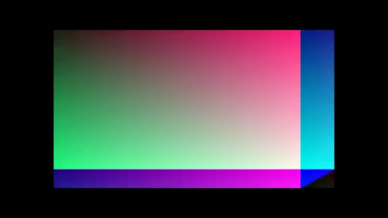

# Real MP4 → wisp playback (M-DEC.2 + M-PLAY.1)

This is the first chunk that puts the *complete* data path together:

```text
sample.mp4
   │
   ▼
gst-discoverer-1.0 ── width / height / fps / duration ──▶ Player metadata
   │
   ▼
gst-launch-1.0 ! filesrc ! decodebin ! videoconvert ! BGRA ! fdsink fd=1
   │
   ▼  raw BGRA bytes on stdout
   │
GstreamerPipeStream ── implements VideoStream ──▶ Player::tick(dt)
                                                   │
                                                   ▼
                              VideoTexture::upload_bgra
                                                   │
                                                   ▼
                                       wisp::Sprite + Renderer
                                                   │
                                                   ▼
                                       RenderTexture → PNG
```

## How to run

The committed test fixture ships with the repo, so the example is
runnable with no setup beyond `brew install gstreamer`:

```bash
cargo run -p playback --example play_file
```

Custom video:

```bash
cargo run -p playback --example play_file -- /path/to/video.mp4
```

## Output (running against `tests/fixtures/sample.mp4`)

The fixture is the M-DEC.1 mock-stream gradient, encoded once with x264
into an 11 KB MP4. The example pulls it back through GStreamer + Player
+ wisp and writes one PNG per render-tick where a frame was uploaded.

| Tick 00 | Tick 01 | Tick 02 | Tick 03 |
|---|---|---|---|
|  |  |  |  |

| Tick 04 | Tick 05 | Tick 06 |
|---|---|---|
|  |  |  |

The first tick pulls two frames (catch-up — `t=0` and `t=1/30 s` are
both due before the wallclock has advanced past either), then it
settles to one frame per tick. The Player exits to `Ended` cleanly
when the GStreamer pipe returns EOF.

## Why GStreamer (and why CLI not crate)

GStreamer is LGPL and modular: `decodebin` auto-selects the best codec
plugin for the file, including hardware decoders (`vtdec` on macOS,
`vah264dec` on Linux, `nvh264dec` with NVIDIA). Switching backends never
touches our code.

The CLI-pipe approach trades a fork for zero compile-time integration.
For the player loop that's one fork for the whole stream, not per-frame —
overhead is amortised. The Rust-bound integration (`gstreamer-rs`) is
queued as M-DEC.3+; the [`VideoStream`](../api/decode/trait.VideoStream.html)
trait makes that swap a one-line change at the call site.

## What's now possible

With this chunk landed, the recorder has 4 of 6 stages on the path to
"first MP4 plays in Tauri-Leptos via wisp":

- ✅ M-DEC.1 — `VideoStream` trait + `MockVideoStream`
- ✅ M-PLAY.1 — `Player` state machine + frame pump
- ✅ M-DEC.2 — `GstreamerPipeStream` (real MP4 decode)
- ✅ M-INT.1 — Trunk + Leptos in Tauri (replace the vanilla JS frontend)
- ✅ M-INT.2 — Tauri serves Trunk bundle + OS file-drop wiring
- ✅ M-PREVIEW.1 — Native winit sibling window with the wisp surface
- ✅ M-PLAY.2 — Tauri↔player IPC for transport controls

[`GstreamerPipeStream`](../api/decode/gstreamer_pipe/struct.GstreamerPipeStream.html) ·
[`Player`](../api/playback/struct.Player.html) ·
[Decode overview](../decode/overview.md) ·
[Player overview](./overview.md)
