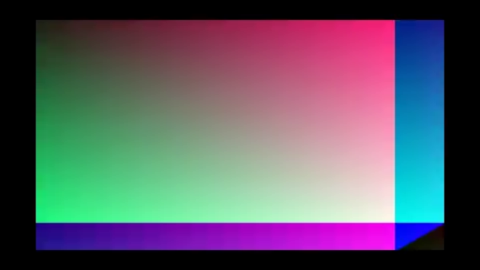
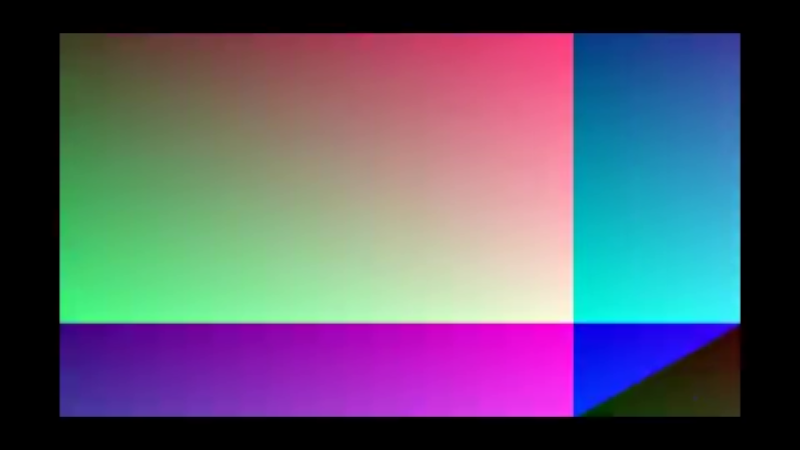
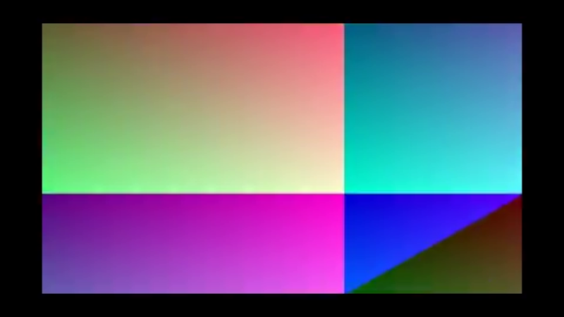
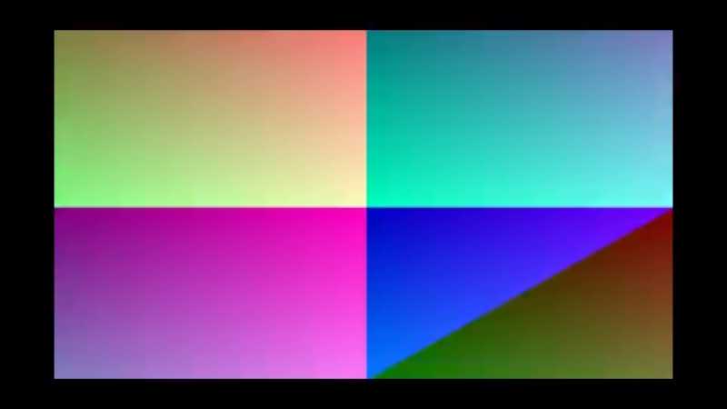
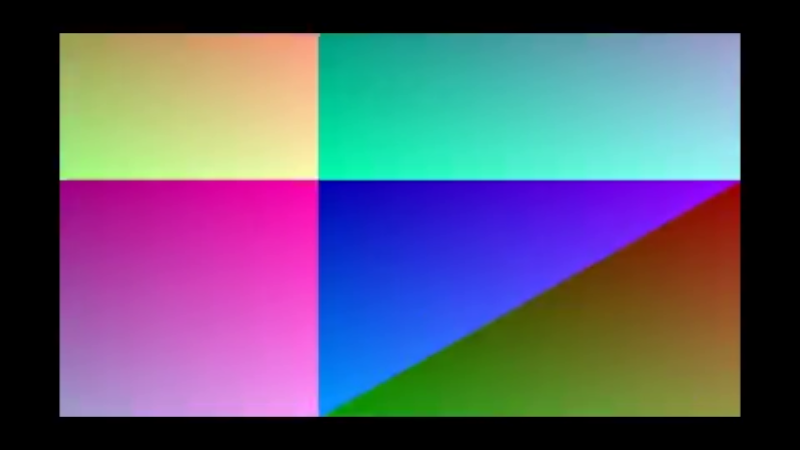

# Native winit window

The fifth chunk on the path to "first MP4 plays in the recorder via wisp".
Builds a real OS window via [winit] 0.30 and hands the wgpu surface to
wisp through [`Application::from_wgpu`].

## What landed

- `crates/preview/` — new crate with both a `[lib]` (pure helpers) and a
  `[[bin]]` (the winit app).
- `Application::from_wgpu` is the seam between embedding host (winit, in
  the future a winit child of Tauri) and wisp's `Renderer`.
- The window auto-sizes to the source video (clamped to a 640×360
  minimum so it isn't comically small for tiny test fixtures).
- The sprite is centered and `aspect_fit_scale`-letterboxed against the
  current surface dimensions, so resizing the window keeps the video
  proportional.

## Visual proof — `render_offscreen` example

The example rebuilds the same render path against an offscreen
`RenderTexture` (no winit window required), so it runs in CI and produces
a deterministic asset:

```bash
cargo run -p preview --example render_offscreen
```

Five frames into a 800×450 surface (16:9), with the 480×270 fixture
letterboxed to fit.

> **What you're looking at.** The committed `sample.mp4` test
> fixture is a deterministic *synthetic* gradient (the M-DEC.1
> mock-stream encoded once with x264 into an 11 KB MP4) — the
> visible "gradient look" is the fixture content, not a rendering
> bug. The chapter's claim is that the
> `winit → wgpu → Application::from_wgpu → Player::tick → Renderer`
> path delivers decoded frames into the surface; the
> horizontal-phase advance frame-to-frame is the proof. For a more
> representative example of decoded-video output, see the
> [`media` chapters](../../media/video-capture.html) which use
> `videotestsrc` SMPTE colorbars.

| Frame 00 | Frame 01 | Frame 02 |
|---|---|---|
|  |  |  |

| Frame 03 | Frame 04 |
|---|---|
|  |  |

## Done when

- ✅ `cargo run -p preview` opens a window and plays the fixture.
- ✅ `cargo run -p preview -- <path>` plays an arbitrary file.
- ✅ The sprite respects letterbox/pillarbox math when surface and video
      aspect ratios differ (covered by `aspect_fit_scale` unit tests).
- ✅ `tests/render_smoke.rs` exercises the `from_wgpu` codepath
      headlessly — non-clear, non-uniform pixels in the readback.
- ✅ Window resize reconfigures the surface without recreating wgpu
      (keeps the device alive across resizes).

## What's next

- M-PLAY.2 — Tauri↔player IPC for transport controls (last remaining
  chunk on the path to "first MP4 plays in the recorder").
- After that, the winit preview window becomes a *child* of the Tauri
  process (today it's a standalone binary), wired via
  [`tauri::WebviewWindowBuilder`](https://docs.rs/tauri) +
  `Window::run_event_loop` integration.

[winit]: https://docs.rs/winit
[`Application::from_wgpu`]: ../../api/wisp/application/struct.Application.html#method.from_wgpu
