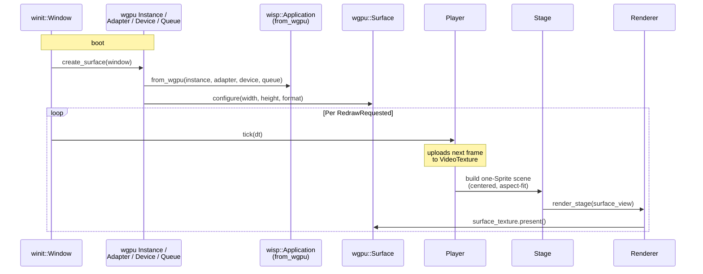

# `preview` — overview

A native [winit] window with a [wgpu] surface that [wisp] renders into.
Plays an MP4 end-to-end through the
[decode](../decode/overview.md) → [playback](../playback/overview.md) →
[wisp](../wisp/overview.md) stack:



## Why it exists

The recorder's editor view is a native sibling window — not the Tauri
webview — because GPU-accelerated 4K video preview behind WebKit's
compositor isn't a viable path. `preview` proves the contract: wisp can
attach to a host-supplied wgpu device and render every frame into the
host's surface.

`Application::from_wgpu` is the seam. The Tauri shell will wire two
separate windows (the WebKit-backed shell window + a winit-backed
preview window) and hand wisp the wgpu objects from the latter.

## Run it

```bash
# Default fixture (committed test MP4):
cargo run -p preview

# Custom video:
cargo run -p preview -- /path/to/video.mp4
```

The window title is `screen — preview`. Close it to exit; playback will
also auto-exit when the stream reaches EOF.

## Headless asset generator

`render_offscreen` is the same pipeline driven against a
[`RenderTexture`](../api/wisp/struct.RenderTexture.html) instead of a
winit surface. Used both as the chapter's PNG source and as a CI-safe
smoke test for the `from_wgpu` codepath:

```bash
cargo run -p preview --example render_offscreen
```

## Anti-regression

- [`aspect_fit_scale`](../api/preview/fn.aspect_fit_scale.html) is unit-tested for
  matching/wider/taller/zero cases.
- `tests/render_smoke.rs` exercises the full
  [`Application::from_wgpu`](../api/wisp/application/struct.Application.html#method.from_wgpu)
  → Player → Renderer → RenderTexture path and asserts the rendered
  output is non-trivial (not the clear color, not uniform).

[winit]: https://docs.rs/winit
[wgpu]: https://docs.rs/wgpu
[wisp]: ../wisp/overview.md
