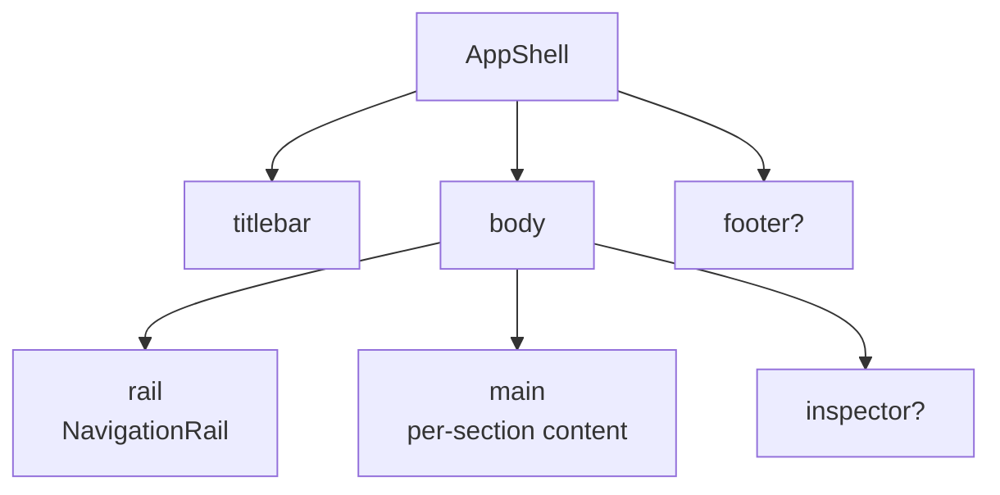

# App shell

[Linear: AUT-122](https://linear.app/harwood/issue/AUT-122)

Top-level layout with slots for rail / main / inspector / titlebar /
footer. Each product screen (library, editor, cursor studio, prefs)
mounts one `AppShell` with the panes it needs — chrome stays
consistent across surfaces.

<iframe src="../../assets/ui/app-shell-three-pane.html" width="780" height="500" frameborder="0"></iframe>

[Open as live demo →](../../assets/ui/app-shell-three-pane.html)

## Slots

| Slot | Required | Use |
| --- | --- | --- |
| `rail` | yes | Left-edge `NavigationRail` |
| `main` | yes | The product surface |
| `titlebar` | optional | Top window-chrome strip |
| `inspector` | optional | Right-edge property / inspector panel |
| `footer` | optional | Bottom status / recording-controls footer |

```admonish info title="Why slots, not a router"
The shell is structural. It places its panes; it does not decide
which content goes where. App-ui chooses the children for each slot
based on the currently-selected `AppSection`; the shell just
arranges them.
```

## Composition



## API

```rust
use ui_storybook::components::{AppShell, NavigationRail, /* … */};

view! {
    <AppShell
        rail=ToChildren::to_children(move || view! { <NavigationRail … /> })
        main=ToChildren::to_children(move || view! { /* editor canvas / library grid / … */ })
        inspector=ToChildren::to_children(move || view! { /* property rows */ })
        titlebar=ToChildren::to_children(move || view! { <span>"Recording 02"</span> })
        footer=ToChildren::to_children(move || view! { /* status bar */ })
    />
}
```

Each slot accepts `Children` (a `Box<dyn FnOnce() -> AnyView>`).
Optional slots accept `Option<Children>`; pass `ToChildren::to_children(...)`
to populate them and omit the prop to skip.

## What this unlocks

Every UI-14..21 ticket plugs into this shell. The library is
`AppShell { rail: …, main: LibraryGrid, inspector: None }`. The
editor is `AppShell { rail: …, main: EditorCanvas, inspector:
InspectorPanel, footer: TimelineSkeleton }`. Cursor Studio is
`AppShell { rail: …, main: CursorPreviewCanvas, inspector:
CursorStyleControls }`. None of those slots care about the others.
