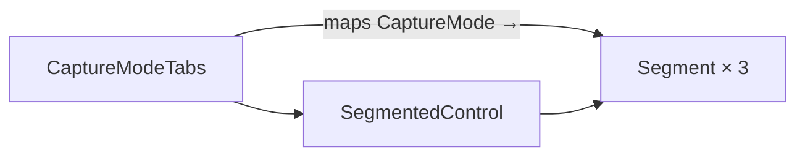

# Capture mode tabs

[Linear: AUT-126](https://linear.app/harwood/issue/AUT-126)

Three tabs at the top of the tray record popover: Screen / Window /
Area. The first visible control on the record-from-tray path — it
determines which setup UI is showing.

| Mode | Story |
| --- | --- |
| Screen | [`capture-mode-screen`](../../assets/ui/capture-mode-screen.html) |
| Window | [`capture-mode-window`](../../assets/ui/capture-mode-window.html) |
| Area | [`capture-mode-area`](../../assets/ui/capture-mode-area.html) |
| Disabled (Area) | [`capture-mode-disabled-area`](../../assets/ui/capture-mode-disabled-area.html) |

<iframe src="../../assets/ui/capture-mode-screen.html" width="320" height="80" frameborder="0"></iframe>

## API

```rust
use ui_storybook::components::CaptureModeTabs;
use ui_storybook::fixtures::recorder::CaptureMode;

view! {
    <CaptureModeTabs
        selected=CaptureMode::Screen
        // optional — gray out modes the user can't enter:
        disabled_modes=vec![CaptureMode::Area]
    />
}
```

## Composition



`CaptureModeTabs` is a thin wrapper that maps the three
`CaptureMode` enum values to `Segment`s and forwards them to
[`SegmentedControl`](./controls.md). The component itself owns no
state; `selected` is a prop.

```admonish note title="Disabled is a list, not a per-mode flag"
`disabled_modes` is `Vec<CaptureMode>` so the parent can express
"Area is currently blocked by permissions" without inventing a new
`Area::Disabled` variant. Empty vec = all enabled.
```
