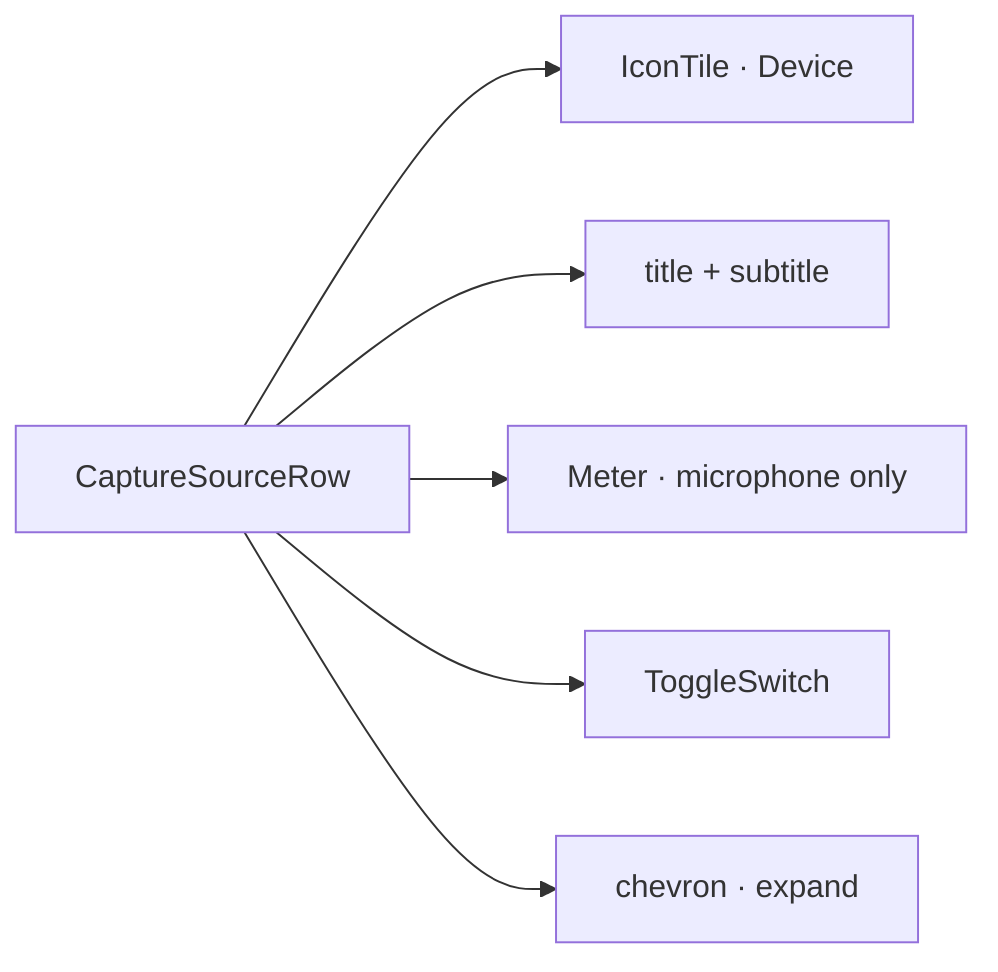

# Capture source row

[Linear: AUT-128](https://linear.app/harwood/issue/AUT-128)

Collapsed row in the tray record popover for the camera + microphone
slots. Five grid columns: leading icon tile, title + subtitle column,
optional live meter, on/off toggle, expand chevron.

<iframe src="../../assets/ui/capture-source-camera-collapsed.html" width="400" height="80" frameborder="0"></iframe>

[Camera](../../assets/ui/capture-source-camera-collapsed.html) ·
[Microphone with meter](../../assets/ui/capture-source-microphone-collapsed.html)

## API

```rust
use ui_storybook::components::{
    CaptureSourceRow, CaptureSourceView, CaptureSourceKind,
};

view! {
    <CaptureSourceRow view=CaptureSourceView {
        id: "mic-built-in",
        kind: CaptureSourceKind::Microphone,
        title: "MacBook Pro Microphone",
        subtitle: "Built-in · 48 kHz",
        enabled: true,
        expanded: false,
        favorite: true,
        level: Some(0.45),
    } />
}
```

```admonish important title="Meter is microphone-only"
`view.level` only renders when `kind == Microphone`. Cameras ignore
the value — the meter slot stays empty even if the prop is `Some`.
That keeps `CaptureSourceView` symmetric for the parent without
forcing kind-specific structs.
```

## Composition



Reuses `IconTile` (UI-01), `Meter` (UI-04), `ToggleSwitch` (UI-04).
No new primitives — composition only.
