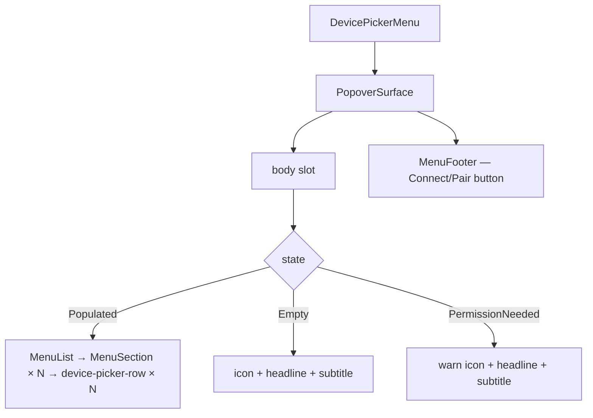

# Device picker menu

[Linear: AUT-128](https://linear.app/harwood/issue/AUT-128)

Popover that opens from the `CaptureSourceRow` chevron. Lists
available devices for the camera or microphone slot. Composes UI-03
`PopoverSurface` + `MenuList` + a custom `device-picker-row` shape
(thumbnail + name/detail + optional badge + optional meter + selected
check).

<iframe src="../../assets/ui/device-picker-camera-open.html" width="380" height="380" frameborder="0"></iframe>

## States

| State | Story |
| --- | --- |
| Cameras populated | [`device-picker-camera-open`](../../assets/ui/device-picker-camera-open.html) |
| Microphones populated, live meters | [`device-picker-microphone-open`](../../assets/ui/device-picker-microphone-open.html) |
| No devices detected | [`device-picker-empty`](../../assets/ui/device-picker-empty.html) |
| Permission needed | [`device-picker-permission-needed`](../../assets/ui/device-picker-permission-needed.html) |

## API

```rust
use ui_storybook::components::{
    DevicePickerMenu, DevicePickerState, DeviceOptionView,
    CaptureSourceKind,
};

view! {
    <DevicePickerMenu
        kind=CaptureSourceKind::Camera
        devices=fixtures::devices::sample_camera_options()
        // optional — defaults to Populated
        state=DevicePickerState::Populated
    />
}
```

```admonish important title="Empty + permission paths bypass the device list"
When `state != Populated`, `devices` is ignored. The component
renders a centered icon + headline + subtitle from a fixed
template. This keeps the parent from having to branch on which list
to pass — pass the real list always; the picker handles the empty
case itself.
```

## `DeviceOptionView` shape

```rust
pub struct DeviceOptionView {
    pub id: &'static str,
    pub name: &'static str,
    pub detail: &'static str,
    pub badge: Option<&'static str>,    // "Wireless", "New"
    pub selected: bool,                 // ✓ checkmark
    pub level: Option<f32>,             // microphone meter
    pub thumbnail: Option<DeviceThumb>, // camera thumbnail tile
}
```

Cameras typically set `thumbnail` + `level = None`. Microphones
typically set `level = Some(0..=1)` + `thumbnail = None`. The
component handles both gracefully.

## Composition


