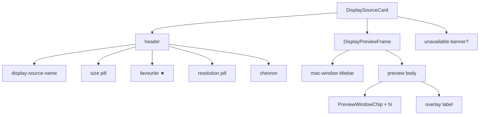

# Display source card

[Linear: AUT-127](https://linear.app/harwood/issue/AUT-127)

Tray-popover card that shows which screen is selected for recording.
Header carries the display name, size, favourite glyph, resolution
pill, and chevron; body holds the mock preview frame.

<iframe src="../../assets/ui/display-source-built-in-retina.html" width="400" height="320" frameborder="0"></iframe>

## States

| State | Story |
| --- | --- |
| Built-in Retina, selected | [`display-source-built-in-retina`](../../assets/ui/display-source-built-in-retina.html) |
| Open chevron (picker showing) | [`display-source-selected`](../../assets/ui/display-source-selected.html) |
| Unavailable (permissions) | [`display-source-unavailable`](../../assets/ui/display-source-unavailable.html) |
| Wide preview (21:9) | [`display-preview-wide`](../../assets/ui/display-preview-wide.html) |
| Small preview (16:10 single window) | [`display-preview-small`](../../assets/ui/display-preview-small.html) |

## API

```rust
use ui_storybook::components::{DisplaySourceCard, DisplaySourceView};
use ui_storybook::fixtures::devices::sample_display_source;

view! {
    <DisplaySourceCard view=sample_display_source(true) open=false />
}
```

`DisplaySourceView` carries the static metadata (name, size,
dimensions, favorite, selected) plus a `DisplayPreviewView` for the
preview frame.

## Preview frame

`DisplayPreviewFrame` is the mocked canvas. It renders a titlebar
strip + a body containing positioned `PreviewWindowChip`s. Each chip
is a colored rounded rect at a percentage offset / size — the
deterministic "non-Wisp fallback" called out in the spec.

```admonish important title="Deterministic, SSR-stable"
The preview is CSS-positioned divs, not a `<canvas>`. SSR renders
identical bytes every time the storybook exports, so the snapshot
gate doesn't churn. A future Wisp-backed PNG export can land via the
existing `wisp-export-stories` harness without changing this
component's API.
```

## Aspect-ratio helper

`aspect_ratio_css(num, den) -> String` produces `"<num> / <den>"` for
the CSS `aspect-ratio` property, falling back to `"1 / 1"` when the
denominator is zero. Unit-tested.

## Composition


