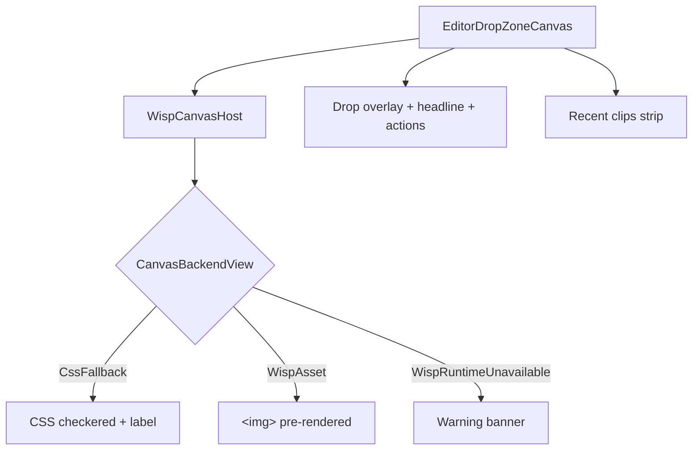

# Editor drop zone + Wisp canvas host

[Linear: AUT-137](https://linear.app/harwood/issue/AUT-137)

The editor's center canvas region. `WispCanvasHost` picks a
backend — `CssFallback` (used by SSR + mdBook), a pre-rendered
`WispAsset { asset_path }`, or `WispRuntimeUnavailable` (renders a
warning banner). `EditorDropZoneCanvas` wraps the host in the
dotted drop overlay + action cards + recent-clips strip the user
sees when no clip is loaded.

<iframe src="../../assets/ui/editor-drop-zone-with-recent.html" width="780" height="540" frameborder="0"></iframe>

## States

| State | Story |
| --- | --- |
| Empty | [`editor-drop-zone-empty`](../../assets/ui/editor-drop-zone-empty.html) |
| Drag active | [`editor-drop-zone-drag-active`](../../assets/ui/editor-drop-zone-drag-active.html) |
| With recent clips | [`editor-drop-zone-with-recent`](../../assets/ui/editor-drop-zone-with-recent.html) |
| Canvas host — CSS fallback | [`wisp-canvas-host-fallback`](../../assets/ui/wisp-canvas-host-fallback.html) |
| Canvas host — runtime unavailable | [`wisp-canvas-host-asset`](../../assets/ui/wisp-canvas-host-asset.html) |

## API

```rust
use ui_storybook::components::editor::{
    EditorDropZoneCanvas, WispCanvasHost, CanvasBackendView,
};
use ui_storybook::fixtures::editor::sample_editor_drop_zone;

view! {
    <EditorDropZoneCanvas view=sample_editor_drop_zone(/* drag_active */ false) />
}
```

```admonish important title="Three backends, deterministic SSR"
The component never touches `wgpu` directly — it just renders the
backend the parent picked. `CssFallback` keeps SSR + mdBook
snapshots stable; future tickets that wire up a real wgpu canvas
in CSR will swap in `WispAsset` (committed PNG) or implement a
runtime path without changing the component contract.
```

## Composition


