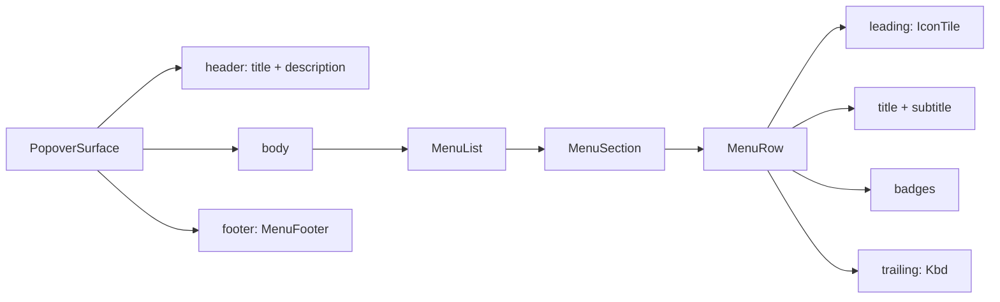

# Menu row

[Linear: AUT-123](https://linear.app/harwood/issue/AUT-123)

The single row used inside every popover menu — workspace switcher,
device pickers, system-audio picker, on-screen options, future
editor menus. The shape covers ~95% of the recurring menu-row needs
without bespoke CSS per menu.

## Kinds

| `MenuRowKind` | Story |
| --- | --- |
| `Default` | (see other rows) |
| `Selected` | [`menu-row-selected`](../../assets/ui/menu-row-selected.html) |
| `Action` | [`menu-row-action`](../../assets/ui/menu-row-action.html) |
| `Danger` | [`menu-row-action`](../../assets/ui/menu-row-action.html) (second row) |
| `Disabled` | bottom of [`popover-with-footer`](../../assets/ui/popover-with-footer.html) |

<iframe src="../../assets/ui/menu-row-device.html" width="320" height="80" frameborder="0"></iframe>

## Slots

- **`leading`** — `Option<Children>`. Typically an `IconTile`
  (device / app / workspace flavor).
- **`title`** — required `String`. Truncates with `text-overflow:
  ellipsis` when the row narrows.
- **`subtitle`** — optional `String`. Same truncation behavior.
- **`badges`** — `Vec<MenuBadgeView>`. Each `(label, BadgeKind)` pair
  renders inline between the text and trailing slot.
- **`trailing`** — `Option<Children>`. Typically a `Kbd` shortcut chip
  or a chevron glyph.

```admonish note title="Selected kind injects a check"
`MenuRowKind::Selected` also emits a `✓` after the trailing slot —
saves callers from having to thread a check into the trailing prop.
The other kinds don't auto-inject anything.
```

## Composition example



## Long-label behavior

<iframe src="../../assets/ui/menu-long-labels.html" width="300" height="220" frameborder="0"></iframe>

Titles + subtitles truncate at the row's max-width. The badges +
trailing slot stay visible at full size; only the text column shrinks.
This is why the row uses `flex: 1` on the text column and
`flex-shrink: 0` on the badge / trailing columns.
