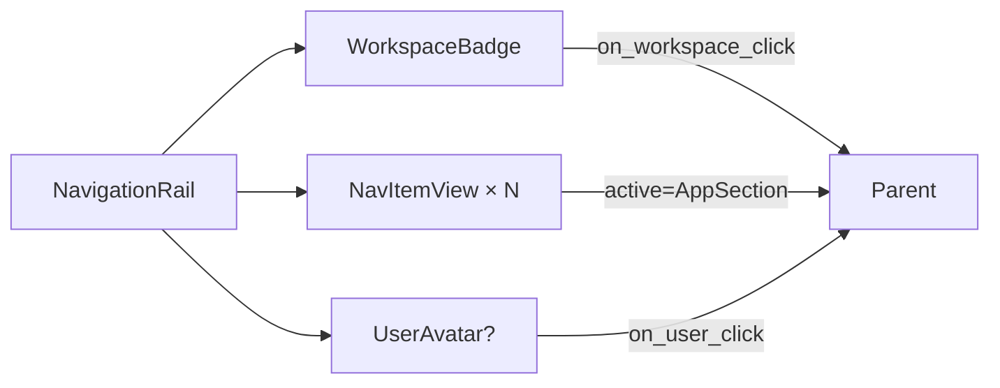

# Navigation rail

[Linear: AUT-122](https://linear.app/harwood/issue/AUT-122)

Left-edge nav for every product surface — record setup, library,
editor, cursor studio, prefs. Structural only: the selected section
is passed in from above; the rail never owns that state.

<iframe src="../../assets/ui/nav-rail-editor-active.html" width="100" height="480" frameborder="0"></iframe>

[Open as live demo →](../../assets/ui/nav-rail-editor-active.html)

## Selected per section

The active class is applied only to the matching item — no internal
state, no router. Each story below renders the rail with a different
`active=AppSection::…`:

| | Active |
| --- | --- |
| [Record](../../assets/ui/nav-rail-record-active.html) | `AppSection::Record` |
| [Library](../../assets/ui/nav-rail-library-active.html) | `AppSection::Library` |
| [Editor](../../assets/ui/nav-rail-editor-active.html) | `AppSection::Editor` |
| [Cursor](../../assets/ui/nav-rail-cursor-active.html) | `AppSection::Cursor` |
| [Library with count](../../assets/ui/nav-rail-with-counts.html) | Library with `count = Some(3)` |

## Composition



The rail composes three primitives from `shell/`:

- `WorkspaceBadge` at the top — the red workspace tile + chevron.
  Visual only; the workspace switcher menu (UI-05) is the parent's
  job.
- A list of `NavItemView` rows, one per `AppSection`.
- `UserAvatar` at the bottom — optional. Pass `None` on surfaces
  that don't show a signed-in user.

```admonish important title="The rail owns no state"
`active` is a prop, not a signal. Callbacks (`on_select`,
`on_workspace_click`) emit; they don't observe. UI-23's grep
guardrail will flag any `RwSignal::new` / `Effect::new` inside the
`nav_rail` module.
```

## API

```rust
use ui_storybook::components::{
    AppSection, NavItemView, NavigationRail,
    WorkspaceBadgeView, UserAvatarView,
};

view! {
    <NavigationRail
        items=items                // Vec<NavItemView>
        active=AppSection::Editor  // explicit prop
        workspace=workspace        // WorkspaceBadgeView
        user=user                  // Option<UserAvatarView>
    />
}
```

`NavItemView` lets every row carry icon, label, optional
notification `count`, and a `disabled` flag (rendered with reduced
opacity + `aria-disabled`).

## States covered

| State | Story |
| --- | --- |
| Default — Record active | `nav-rail-record-active` |
| Library active | `nav-rail-library-active` |
| Editor active | `nav-rail-editor-active` |
| Cursor active | `nav-rail-cursor-active` |
| With notification count | `nav-rail-with-counts` |
