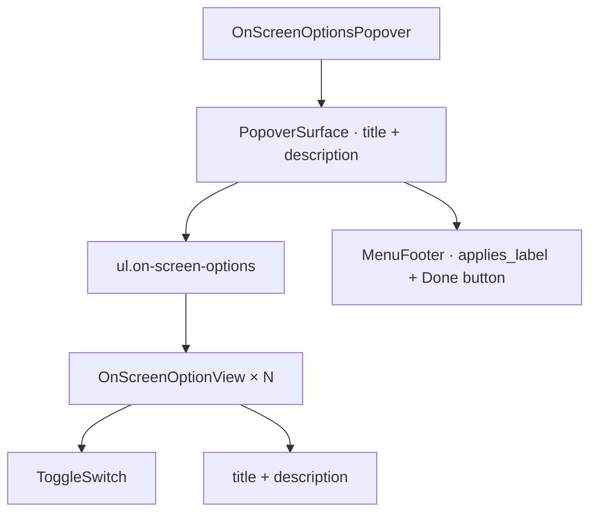

# On-screen options popover

[Linear: AUT-130](https://linear.app/harwood/issue/AUT-130)

Tray popover that controls what shows during recording — desktop
cleanup, keypress overlay, sensitive-info auto-blur. Composes UI-03
`PopoverSurface` + UI-04 `ToggleSwitch`. Three options today; more
can land by extending `OnScreenOptionKind`.

<iframe src="../../assets/ui/on-screen-options-default.html" width="440" height="380" frameborder="0"></iframe>

## States

| State | Story |
| --- | --- |
| Default — some on | [`on-screen-options-default`](../../assets/ui/on-screen-options-default.html) |
| All toggles on | [`on-screen-options-all-on`](../../assets/ui/on-screen-options-all-on.html) |
| Blur Sensitive disabled (feature pending) | [`on-screen-options-sensitive-disabled`](../../assets/ui/on-screen-options-sensitive-disabled.html) |
| Long copy wraps cleanly | [`on-screen-options-long-copy`](../../assets/ui/on-screen-options-long-copy.html) |

## API

```rust
use ui_storybook::components::{
    OnScreenOptionsPopover, OnScreenOptionKind, OnScreenOptionView,
};
use ui_storybook::fixtures::recorder::sample_on_screen_options;

view! {
    <OnScreenOptionsPopover
        options=sample_on_screen_options(false)
        // optional — defaults to "Applies to this recording".
        applies_label="Applies to all recordings"
    />
}
```

## `OnScreenOptionKind`

A stable enum so parents can pattern-match on a row instead of
string-comparing:

- `CleanDesktop` — hide desktop icons + dock
- `ShowKeys` — render keypress badges over the recording
- `BlurSensitiveInfo` — auto-detect + blur sensitive regions

```admonish important title="Disabled is per-row, not all-or-nothing"
`OnScreenOptionView::disabled` lets the parent dim individual rows
while a feature is still pending. `BlurSensitiveInfo` ships disabled
today because the runtime detection isn't wired yet — the parent can
set `disabled = false` once the backend lands and the row turns on.
```

## Composition


