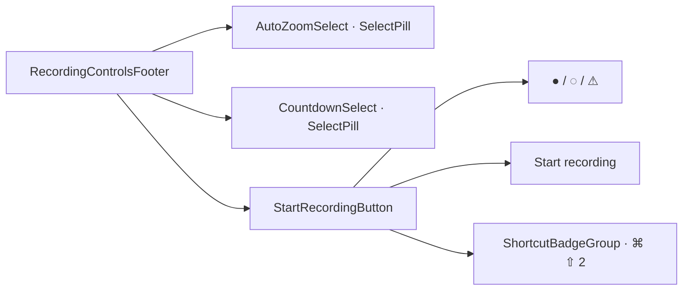

# Recording controls footer

[Linear: AUT-131](https://linear.app/harwood/issue/AUT-131)

Bottom row of the tray record popover — the final visible step
before the first recording starts. Auto-zoom + countdown pills on
the left, prominent red Start recording button on the right with
the keyboard shortcut hint inside.

<iframe src="../../assets/ui/recording-footer-ready.html" width="480" height="116" frameborder="0"></iframe>

## States

| State | Story |
| --- | --- |
| Ready | [`recording-footer-ready`](../../assets/ui/recording-footer-ready.html) |
| Disabled (no source selected) | [`recording-footer-disabled`](../../assets/ui/recording-footer-disabled.html) |
| Loading (start dispatched) | [`recording-footer-loading`](../../assets/ui/recording-footer-loading.html) |
| Permission blocked | [`recording-footer-permission-blocked`](../../assets/ui/recording-footer-permission-blocked.html) |
| Compact (no zoom / no countdown) | [`recording-footer-compact`](../../assets/ui/recording-footer-compact.html) |

## API

```rust
use ui_storybook::components::{
    RecordingControlsFooter, RecordingControlsView, StartRecordingState,
};
use ui_storybook::fixtures::recorder::sample_recording_controls;

view! {
    <RecordingControlsFooter
        view=sample_recording_controls(StartRecordingState::Ready)
        // optional callbacks; stories leave them unset.
    />
}
```

## Composition



```admonish important title="Permission-blocked is interactive"
`StartRecordingState::Disabled` and `Loading` render the button
non-interactive. `PermissionBlocked` keeps the button active —
clicking it should open the permission prompt — and renders as the
amber variant so it reads as a warning rather than a primary CTA.
```

```admonish note title="Shortcut order is preserved"
The footer renders `view.shortcuts` in input order. The
`recording_controls_preserve_shortcut_order` test guards against a
future refactor that sorts them.
```
