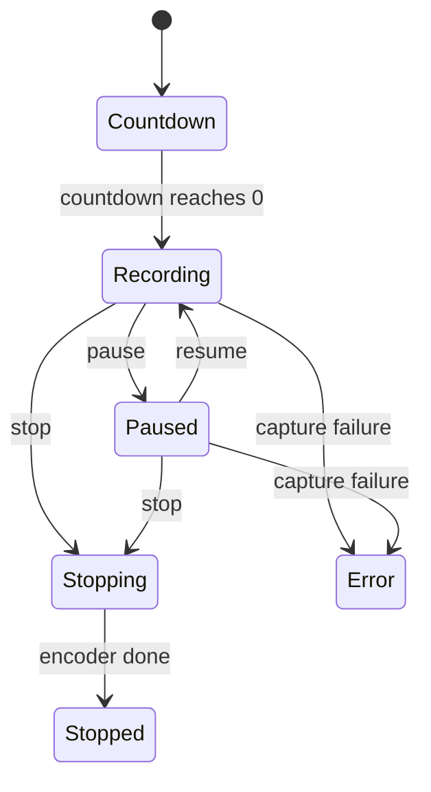

# Recording status button

[Linear: AUT-133](https://linear.app/harwood/issue/AUT-133)

Compact pill that replaces the red Start button after capture
begins. Used in the system tray and any other small surface that
needs the live recording status without the full footer.

<iframe src="../../assets/ui/recording-status-recording.html" width="400" height="80" frameborder="0"></iframe>

## States

| State | Story |
| --- | --- |
| Countdown 3s | [`recording-status-countdown-3`](../../assets/ui/recording-status-countdown-3.html) |
| Countdown 1s | [`recording-status-countdown-1`](../../assets/ui/recording-status-countdown-1.html) |
| Recording | [`recording-status-recording`](../../assets/ui/recording-status-recording.html) |
| Paused | [`recording-status-paused`](../../assets/ui/recording-status-paused.html) |
| Stopping | [`recording-status-stopping`](../../assets/ui/recording-status-stopping.html) |
| Error | [`recording-status-error`](../../assets/ui/recording-status-error.html) |

## API

```rust
use ui_storybook::components::recorder::{
    RecordingStatusButton, CompactRecordingState,
};

view! {
    <RecordingStatusButton
        state=CompactRecordingState::Recording {
            elapsed_label: "00:42".into(),
        }
        shortcuts=vec!["⌘".into(), "⇧".into(), "2".into()]
    />
}
```

```admonish important title="No timers inside the component"
`elapsed_label` and `seconds_remaining` come from the parent each
frame. The component has no `set_interval`, no `Effect`, no clock
of its own — which is what keeps it SSR-stable and deterministic in
snapshots. `app-ui` owns the timer that ticks both values.
```

## Composition


