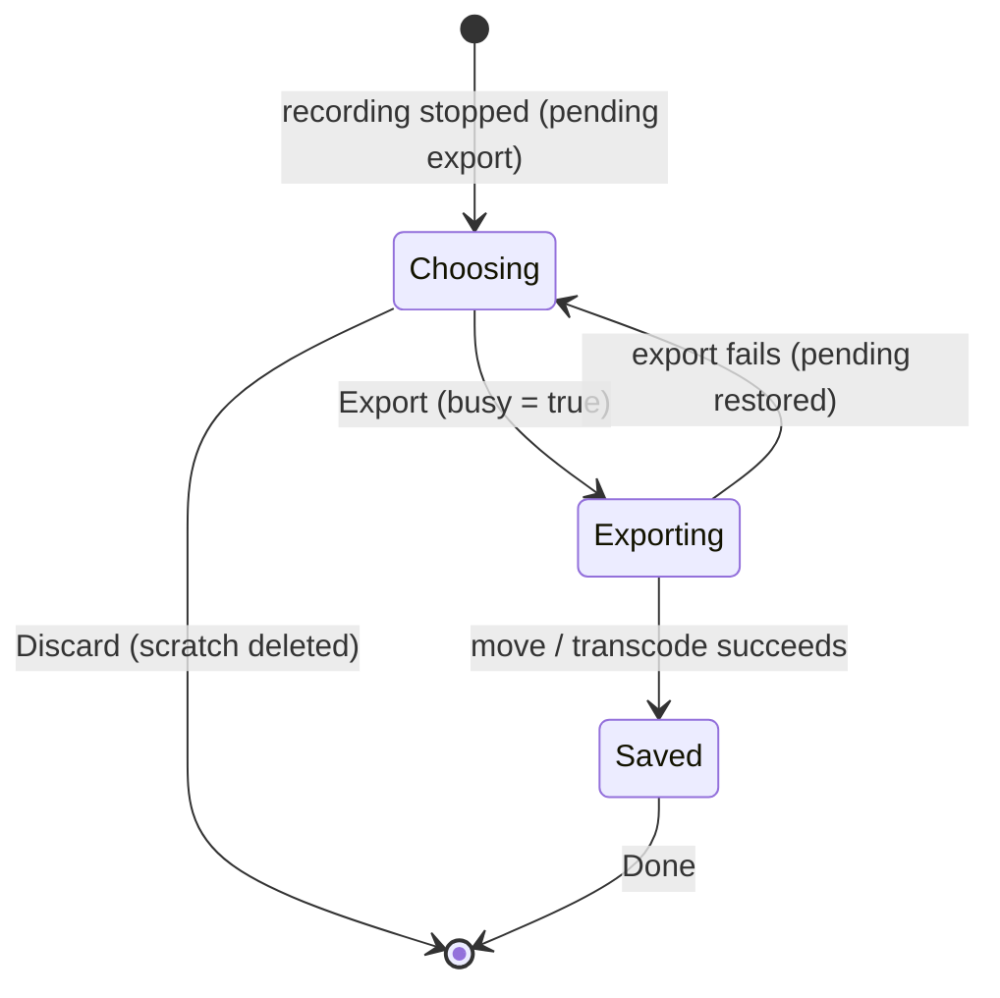

# Save panel

The post-record Save panel. Once a recording stops it isn't written
straight to disk — it's parked in a scratch file awaiting export, and
this panel replaces the record/stop footer so the user can pick the
output folder + container format, then **Export** or **Discard**. After
a successful export it flips to a "Saved to `<path>`" confirmation with
**Reveal in Finder** / **Done**.

It is presentational: the parent (`app-ui`'s `RecorderPage`) owns the
pending export, the chosen format, the in-flight flag, and the saved
path, maps them into a [`SavePanelView`](../../api/ui_storybook/components/recorder/save_panel/enum.SavePanelView.html),
and wires the callbacks to the Tauri IPC commands.

<iframe src="../../assets/ui/save-panel-choosing.html" width="480" height="240" frameborder="0"></iframe>

## States

| State | Story |
| --- | --- |
| Choosing — folder + format, controls live | [`save-panel-choosing`](../../assets/ui/save-panel-choosing.html) |
| Exporting — controls dimmed, button reads "Exporting…" | [`save-panel-exporting`](../../assets/ui/save-panel-exporting.html) |
| Saved — Reveal in Finder / Done | [`save-panel-saved`](../../assets/ui/save-panel-saved.html) |



## API

```rust
use ui_storybook::components::recorder::{SaveFormat, SavePanel, SavePanelView};

view! {
    <SavePanel
        view=SavePanelView::Choosing {
            output_dir: "/Users/you/Movies/Screen".into(),
            format: SaveFormat::Mp4H264,
            busy: false,
        }
        // optional callbacks; stories leave them unset.
        // on_change_folder / on_format_change / on_discard /
        // on_export / on_reveal / on_done
    />
}
```

```admonish note title="The format dropdown is controlled"
The `<select>` is a controlled element — it renders `selected` from
the `format` field of the view-model and emits the newly-chosen
[`SaveFormat`](../../api/ui_storybook/components/recorder/save_panel/enum.SaveFormat.html)
through `on_format_change`. The parent stores the slug
(`mp4-h264` / `webm-vp9`) and feeds it straight to `export_recording`,
so the panel never holds format state itself.
```

```admonish warning title="MP4 is a move, WebM transcodes"
`SaveFormat::Mp4H264` is the scratch's native format, so exporting it
is an atomic file move — instant. `SaveFormat::WebmVp9` runs a
software-VP9 transcode that takes a few seconds, which is why the
`busy` flag exists: it dims the controls and flips the Export button
to "Exporting…" for the duration.
```
