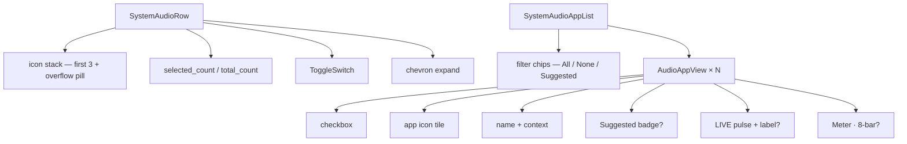

# System audio picker

[Linear: AUT-129](https://linear.app/harwood/issue/AUT-129)

Tray-popover section for picking which apps' audio joins the
recording. Two components: a **collapsed** row (selected count +
overlapping app-icon stack + toggle) and an **expanded** list
(filter chips + per-app rows with selection checkbox, Suggested
badge, LIVE pulse, and meter).

<iframe src="../../assets/ui/system-audio-collapsed.html" width="400" height="80" frameborder="0"></iframe>

## States

| State | Story |
| --- | --- |
| Collapsed (some selected) | [`system-audio-collapsed`](../../assets/ui/system-audio-collapsed.html) |
| Expanded with Suggested filter | [`system-audio-expanded`](../../assets/ui/system-audio-expanded.html) |
| Expanded — None selected | [`system-audio-none-selected`](../../assets/ui/system-audio-none-selected.html) |
| Expanded — All selected | [`system-audio-all-selected`](../../assets/ui/system-audio-all-selected.html) |
| Single live row | [`audio-app-row-live`](../../assets/ui/audio-app-row-live.html) |
| Single idle row | [`audio-app-row-muted`](../../assets/ui/audio-app-row-muted.html) |

## API

```rust
use ui_storybook::components::{
    SystemAudioRow, SystemAudioAppList, AudioFilter,
};

// Collapsed row.
view! { <SystemAudioRow view=sample_system_audio_view(true, false, &selected, total) /> }

// Expanded list.
view! { <SystemAudioAppList apps=sample_audio_apps() active_filter=AudioFilter::Suggested /> }
```

```admonish important title="`active_filter` is cosmetic only"
The filter chip just highlights "All", "None", or "Suggested". The
component does NOT change `apps.selected` — the parent already
applied the filter to the `apps` slice it passes in. Clicking a
chip in production fires `on_filter_select(AudioFilter)` and the
parent recomputes selection.
```

## Helpers

- `format_selection_count(selected: usize, total: usize) -> String`
  → `"4 of 7 apps"` (plural) / `"1 of 1 app"` (singular). 5 unit tests.
- `ICON_STACK_MAX: usize = 3` — overflow tips to a `+N` pill above
  that count. Tested.

## Composition



Composition uses UI-01 `Badge`, UI-04 `Meter`, UI-04 `ToggleSwitch` —
no new primitives.
