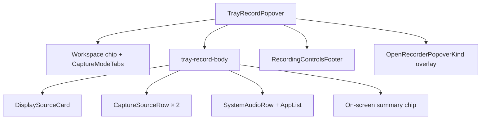

# Tray record popover

[Linear: AUT-132](https://linear.app/harwood/issue/AUT-132)

Top-level composition: the floating black rounded window the user
sees first. Pulls UI-02 → UI-11 together — workspace chip,
capture-mode tabs, display source card, camera + microphone rows,
system audio, on-screen overlay summary, and the recording
controls footer.

<iframe src="../../assets/ui/tray-record-popover-default.html" width="480" height="780" frameborder="0"></iframe>

## States

| State | Story |
| --- | --- |
| Default | [`tray-record-popover-default`](../../assets/ui/tray-record-popover-default.html) |
| Workspace menu open | [`tray-record-popover-workspace-open`](../../assets/ui/tray-record-popover-workspace-open.html) |
| Camera menu open | [`tray-record-popover-camera-open`](../../assets/ui/tray-record-popover-camera-open.html) |
| Microphone menu open | [`tray-record-popover-microphone-open`](../../assets/ui/tray-record-popover-microphone-open.html) |
| System-audio expanded | [`tray-record-popover-system-audio-open`](../../assets/ui/tray-record-popover-system-audio-open.html) |
| On-screen options open | [`tray-record-popover-on-screen-open`](../../assets/ui/tray-record-popover-on-screen-open.html) |
| Start disabled | [`tray-record-popover-start-disabled`](../../assets/ui/tray-record-popover-start-disabled.html) |

## API

```rust
use ui_storybook::components::recorder::{
    TrayRecordPopover, OpenRecorderPopoverKind,
};
use ui_storybook::fixtures::recorder::sample_tray_record_popover;

view! {
    <TrayRecordPopover view=sample_tray_record_popover(OpenRecorderPopoverKind::None) />
}
```

## Composition



```admonish important title="Open overlays are controlled"
`OpenRecorderPopoverKind` is the only state. The component itself
doesn't track which menu is open — the parent (`app-ui`) owns that
signal. This keeps the popover snapshot-stable and lets the same
component drive both keyboard-navigation closing and outside-click
closing without owning either policy.
```
