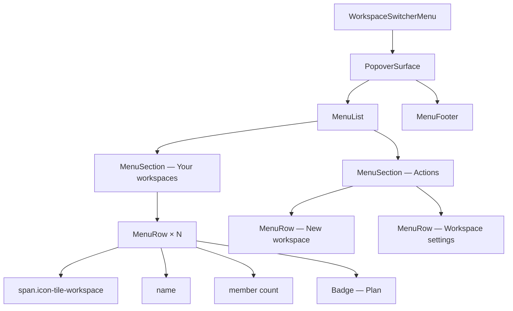

# Workspace switcher menu

[Linear: AUT-125](https://linear.app/harwood/issue/AUT-125)

Popover anchored to the rail's `WorkspaceBadge`. Pure composition of
UI-03 menu primitives + UI-01 surface tokens — no bespoke CSS.

<iframe src="../../assets/ui/workspace-menu-default.html" width="380" height="500" frameborder="0"></iframe>

[Open as live demo →](../../assets/ui/workspace-menu-default.html)

## States covered

| State | Story |
| --- | --- |
| Default — one selected workspace | [`workspace-menu-default`](../../assets/ui/workspace-menu-default.html) |
| Many workspaces | [`workspace-menu-many`](../../assets/ui/workspace-menu-many.html) |
| Long names truncate | [`workspace-menu-long-names`](../../assets/ui/workspace-menu-long-names.html) |
| No selection | [`workspace-menu-no-selection`](../../assets/ui/workspace-menu-no-selection.html) |

```admonish important title="State lives outside the component"
`selected_id` is a prop. The menu doesn't know which workspace is
"current" — `app-ui` passes the active workspace id down and the
menu compares against each row's id to render the ✓.
```

## Composition



## API

```rust
use ui_storybook::components::{WorkspaceSwitcherMenu, WorkspaceView};

view! {
    <WorkspaceSwitcherMenu
        workspaces=fixtures::workspaces::sample_workspace_views()
        selected_id="ws-northwind"
    />
}
```

## Member count formatting

`format_member_count(u32) -> String` renders `1 member` (singular)
vs `N members` (plural). Unit-tested for both branches + zero.
