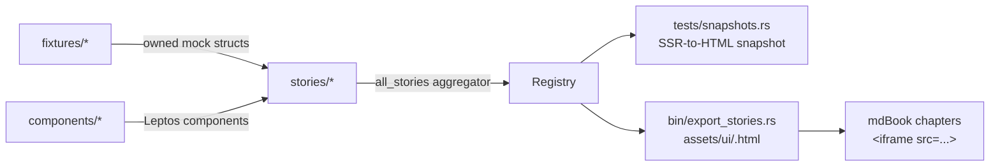

# `ui-storybook` — overview

The HTML/Leptos counterpart to `wisp-storybook`. Every shipped UI component
appears here as a Leptos `#[component]`, with its SSR HTML locked to an
`insta` snapshot — same regression discipline as wisp's quadrant
fingerprints.

[Linear: AUT-120](https://linear.app/harwood/issue/AUT-120)

Rendered demos live under [`assets/ui/`](../assets/ui/). Each is a complete
standalone HTML file with the storybook stylesheet inlined; open it in a
browser tab for a live render.

Regenerate with `just snapshots-ui`.

## Workbench layout



Three sources of truth feed the storybook:

- **`crates/ui-storybook/src/components/`** — the actual Leptos
  components. Subgroups: `primitives`, `shell`, `menus`, `recorder`,
  `library`, `editor`, `cursor`. Public types are re-exported at the
  `components::` level so `ui_storybook::components::Button` resolves
  the same as `components::primitives::Button`.
- **`crates/ui-storybook/src/fixtures/`** — owned mock data structs.
  Stories must not hand-roll inline mocks; every device / workspace /
  recording / track is built from a fixture so the structure stays
  single-sourced.
- **`crates/ui-storybook/src/stories/`** — one file per component
  surface (`primitives.rs`, `shell.rs`, `recorder.rs`, `editor.rs`,
  `menus.rs`, `library.rs`, `cursor.rs`). Each module returns
  `Vec<Story>`; `stories::all_stories()` aggregates them in display
  order.

```admonish important title="Story id is also the asset filename"
A story with `id: "drop-zone-idle"` becomes
`_docs/book/src/assets/ui/drop-zone-idle.html` on export. Renaming an
id breaks every mdBook `<iframe src="…">` that references it.
`tests/story_registry.rs` enforces kebab-case + uniqueness.
```

## Visual baseline: rust-ui

The component set follows [rust-ui](https://www.rust-ui.com)'s shadcn-style
copy-paste convention but lives in this workspace so we can put it under the
same gate as the rest of the code.

Visual style: zinc dark palette, subtle 1px borders, 6/10px radius corners,
muted secondary text, accent for primary actions and the playhead.

## Index

- [Presentational contract](./presentational-contract.md) — the rules
  that keep components stateless and reusable.
- [Components](./components.md) — every component grouped by surface
  (primitives, shell, recorder, editor, …).
- [Dope sheet](./dope-sheet.md) — the editor timeline.
