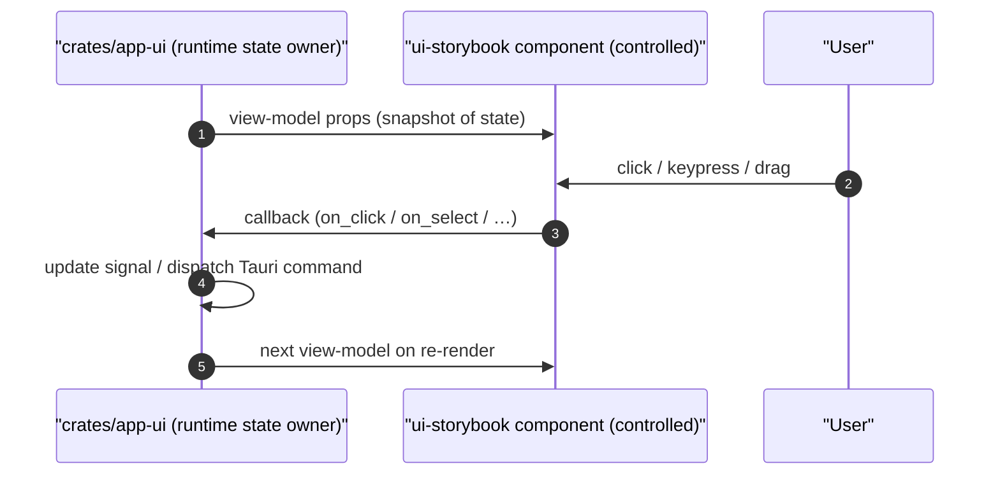

# State boundaries

[Linear: AUT-143](https://linear.app/harwood/issue/AUT-143)

The shortest possible description of where state lives in this
workspace:



## What goes where

| Concern | Lives in | Examples |
| --- | --- | --- |
| Reactive state | `crates/app-ui` | `signal()`, `RwSignal::new()`, `Effect::new()` |
| Tauri IPC | `crates/app-ui` | `invoke("start_recording")`, event listeners |
| Timers + intervals | `crates/app-ui` | recording clock, countdown ticker |
| Persistence | `crates/app-ui` (or future controller crate) | preferences, recent clips, session restore |
| Pure presentation | `crates/ui-storybook` | every `#[component]`, every `view!` macro |
| Stable mock data | `crates/ui-storybook/src/fixtures` | `sample_workspace_views`, `sample_recording_cards` |
| Renderer surface | `crates/wisp` | `RenderTexture`, filters, scene graph |

```admonish important title="Two boundaries, not three"
There are only two boundaries that matter day-to-day:

1. **app-ui ↔ ui-storybook**: callbacks down, view-models up.
2. **wisp ↔ ui-storybook**: only via committed PNGs or feature-gated
   browser-side mounts (see `CanvasBackendView`).

A component never crosses both at once; if a story needs a Wisp
preview it goes through the `WispAsset` backend variant, never
directly into wgpu.
```

## Examples

```rust
// ✅ Good — controlled, callback-out
#[component]
pub fn ToggleSwitch(
    checked: bool,
    on_change: Option<Callback<bool>>,
) -> impl IntoView { /* … */ }
```

```rust
// ❌ Bad — owns app state, calls runtime services
#[component]
pub fn ToggleSwitch() -> impl IntoView {
    let (checked, set_checked) = signal(false);          // ← no signals in components
    Effect::new(move |_| {                               // ← no effects either
        tauri::invoke("preference_set", ...);            // ← no invoke
    });
    // …
}
```

Story-only interactive wrappers can still create a `signal` to make
the demo clickable in the browser — that's allowed as long as it
lives in `stories/` and isn't exported from `components/`.

## Allowed in components

| Thing | Allowed? | Note |
| --- | --- | --- |
| `view!` macro | ✅ | The whole point |
| Plain props | ✅ | Always |
| `Children` slot | ✅ | For composition |
| `Option<Callback<()>>` props | ✅ | Output channel |
| Local helper functions | ✅ | Formatting, class-mapping |
| `RwSignal::new` | ❌ | Use a controlled prop instead |
| `Effect::new` | ❌ | Lives in app-ui |
| `Action::new` | ❌ | App side |
| `invoke` / Tauri API | ❌ | App side |
| `web_sys` direct | ⚠️  Limited | OK for typed event params; never for `localStorage` etc. |

## Story-only wrappers

If a CSR demo needs internal state (e.g. a dropdown that opens on
click for the browser preview), wrap the controlled component in a
story-only thin component:

```rust
// stories/my_story.rs — NOT exported from components
#[component]
fn DemoWrapper() -> impl IntoView {
    let open = RwSignal::new(false);
    view! {
        <SelectPill open=open.get() />
    }
}
```

The wrapper lives in `stories/`, not in `components/`, so the
grep guardrail allows it. The exported `SelectPill` itself stays
controlled.
