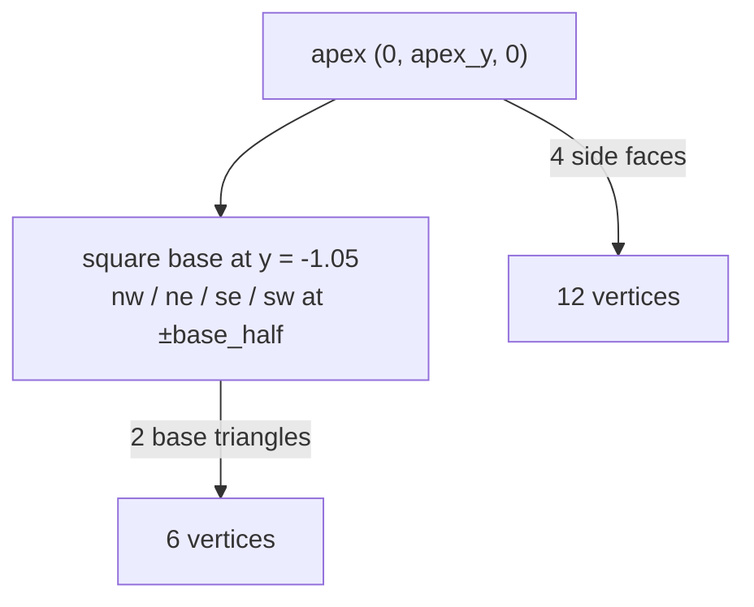

# `Mesh3D`

Indexed triangle mesh: three parallel buffers (`positions`, `normals`, `indices`) sharing one index space. `Vertex3D { position, normal }` is the interleaved GPU layout (24 bytes; layout-tested).

## Flat per-face shading

`Mesh3D::compute_vertex_normals()` writes flat per-face normals — for each triangle, every vertex in the triangle gets the same face normal. Matches `THREE.BufferGeometry::computeVertexNormals()` for non-indexed geometry.

The trade-off vs. shared-vertex meshes: more vertex memory, but sharp dihedrals without a geometry shader. For low-poly geometry like the 404 pyramid (18 vertices) the cost is negligible.

## The pyramid constructor

`Mesh3D::pyramid(apex_y, base_half)` produces the engmanager.xyz 404 layout:



Vertex layout is 18 positions / 18 indices = `0..18`, deliberately not shared so each face owns its normal. Tests assert 5 unique face normals (4 sides + 1 base — base triangles share a normal since they're coplanar).

```admonish note title="`pyramid()` is the reference constructor"
`cube`, `ico_sphere`, etc. follow the same pattern: hand-laid positions per face, `compute_vertex_normals()` at the end, `indices: (0..N).collect()`. The constructor exists to make the 404 port mechanical; bring-your-own meshes are a normal use of `Mesh3D { positions, normals, indices }`.
```
