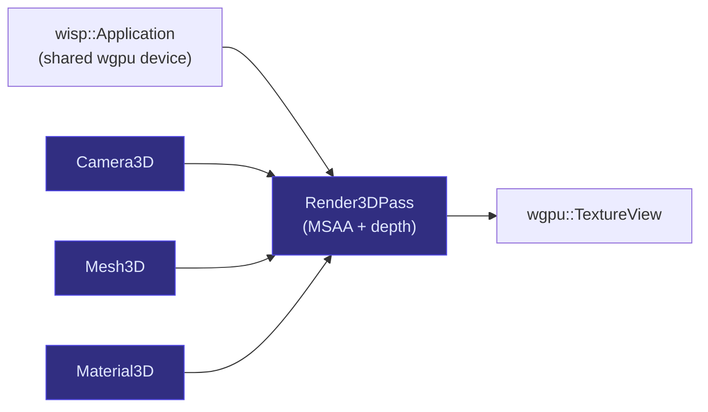

# `wisp-3d` overview

`wisp-3d` is a sibling crate to [`wisp`] that adds real-3D rendering — perspective camera, indexed mesh, depth-tested render pass — without touching `wisp`'s 2D scene-graph-ordered draw contract.

```admonish important title="Why the sibling-crate split"
`wisp`'s render-stage contract has NO depth buffer. Everything draws in scene-graph insertion order, batched per pipeline-type. That's load-bearing for the filter chain's last-wins semantics + the mask system.

3D demands break that contract: a spinning solid needs Z-test so the back face doesn't paint over the front; a `PerspectiveCamera` needs a view+projection pair; an indexed mesh needs per-vertex normals. `wisp-3d` introduces those in its own module tree so the 2D contract stays clean.
```

## Surface



## First customer

The engmanager.xyz 404 page renders a spinning Catppuccin-palette pyramid via THREE.js (loaded from a jsDelivr CDN). `wisp-3d` + `wisp-3d-web` replace that with a same-origin wasm bundle, dropping the third-party JS dep.

## Crate layout

| Module | Purpose | Chapter |
|---|---|---|
| `camera` | `Camera3D` perspective + `ViewProj` UBO | [camera-3d](./camera-3d.md) |
| `mesh` | `Mesh3D` indexed positions/normals + `pyramid()` | [mesh-3d](./mesh-3d.md) |
| `render` | `Render3DPass` depth + MSAA | [render-3d-pass](./render-3d-pass.md) |
| `material` | `Material3D` trait + `PaletteRampMaterial` | [material-3d](./material-3d.md) |
| `edges` | `EdgesMesh` + wireframe pipeline | [edges-mesh](./edges-mesh.md) |
| `sprite` | `Sprite3D` (ring/circle/quad), depth-write off | [sprite-3d](./sprite-3d.md) |
| `reduced_motion` | `prefers-reduced-motion: reduce` query | (inline) |

[`wisp`]: ../wisp-overview.md
