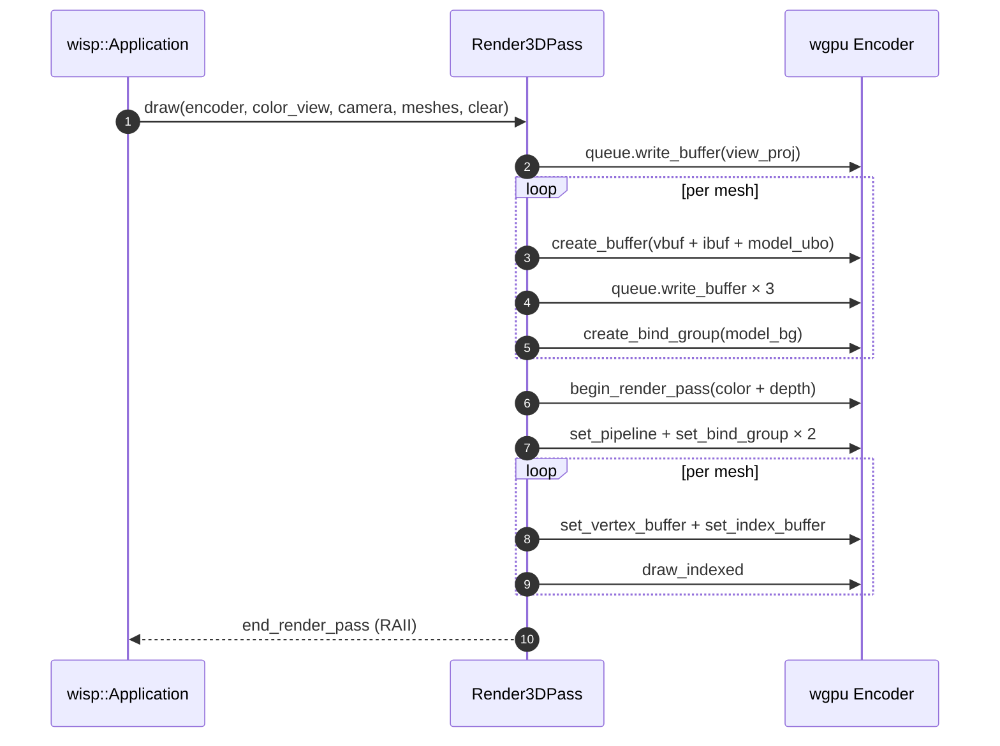

# `Render3DPass`

Depth-tested + MSAA-aware render pass. The rate-limiting risk ticket of the whole `wisp-3d` rollout — wgpu validates depth + MSAA + pipeline state at DRAW time, not at pipeline creation, so mismatches are silent until you submit.

```admonish warning title="The MSAA-sample-count trap"
wgpu requires THREE values to match:

1. The depth texture's `sample_count` in its `TextureDescriptor`.
2. The pipeline's `multisample.count` field.
3. The COLOR attachment's `sample_count` (the surface texture's view).

If any pair disagrees, the failure mode is a `Validation Error / Pipeline ... is bound with sample count X` at submit time — NOT at pipeline creation, and NOT at attachment bind. The plumbing here keeps all three in lock-step via the single `msaa_samples` constructor argument; do not split this knob across multiple knobs.
```

## Per-frame flow



## What's deferred

- **Instancing.** Today each mesh becomes its own VBO+IBO+UBO write per draw. The path is open: collapse meshes that share `(Mesh3D, Material)` into one draw with a per-instance buffer of `Mat4 + tint`. Lands when scale demands it.
- **Pipeline cache.** The default pipeline is one-per-pass. The `Material3D` trait (next chapter) introduces a `TypeId`-keyed cache for user shaders.
