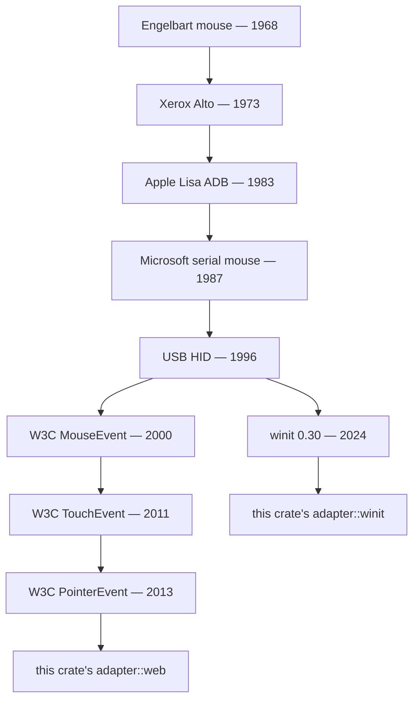

# Adapters — `winit` and `web-sys`

> One normalised vocabulary, many input sources. The adapters are
> pure translation functions — testable without ever opening a
> window.

## The pointer-event lineage (1968 → 2013)

Tracing the family tree of every input event your finger fires
today:



Engelbart's original 1968 mouse reported one button press over a
single wire. The Xerox Alto added three buttons and a serial
protocol. Apple's ADB and Microsoft's serial-then-PS/2 standardised
the transport. USB HID (Human Interface Devices) collapsed
keyboards, mice, gamepads, and tablet pens into one report format
in 1996. The W3C standardised the browser-side surface in three
passes: `MouseEvent` (2000), `TouchEvent` (2011), and finally
`PointerEvent` (2013) — a single typed event covering mouse, touch,
and pen with a stable `pointerId` per contact.

`wisp-interaction` lives at the bottom of that tree. Its `adapter`
module translates whichever event source your host owns (winit on
native windows, `PointerEvent` in browsers) into one normalised
vocabulary: `InputEvent`, `PointerId`, `WheelDelta`, `KeyCode`.

## Pure-function adapters

```admonish important title="No `addEventListener` here"
The adapter modules ship pure translation functions only:
`translate_mouse_button`, `translate_scroll`, `translate_key_code`,
etc. No event-loop wiring. That belongs in the host crate — the
recorder app, the storybook bundle — whichever owns the window or
canvas.

This split makes the translation independently testable (and indeed,
we have 6 winit-translation tests that run on every CI matrix
runner without ever opening a window). The host's wiring code is
mechanical and platform-specific; the translation correctness is
where the bugs live.
```

## The `KeyCode` enum

87 variants matching the intersection of `winit::keyboard::KeyCode`
and W3C UI Events Code strings (`"KeyW"`, `"Digit1"`, `"ArrowUp"`,
`"MetaLeft"` → `SuperLeft`). Letters, digits, F-keys, navigation,
modifiers, punctuation. Anything outside this set returns `None`
from `translate_key_code` — adapters drop unmapped keys silently
(Numpad, IME-only, dead keys).

## The translation table

| Winit / web-sys | wisp-interaction | Notes |
|---|---|---|
| `MouseButton::{Left,Right,Middle,Back,Forward,Other(n)}` | `MouseButton::{Left,Right,Middle,Back,Forward,Other(n)}` | 1:1 |
| W3C `PointerEvent.button` (i16) | same | 0=Left, 1=Middle, 2=Right, ... |
| `MouseScrollDelta::LineDelta` | `WheelDelta::Line(Vec2)` | Mouse-wheel notches |
| `MouseScrollDelta::PixelDelta` | `WheelDelta::Pixel(Vec2)` | Trackpad / touch surface |
| W3C `WheelEvent.deltaMode == LINE` | `WheelDelta::Line` | |
| W3C `WheelEvent.deltaMode == PIXEL` | `WheelDelta::Pixel` | PAGE is treated as Pixel |
| winit `Touch::id: u64` | `PointerId::Touch(u64)` | |
| W3C `pointer_id (i32) + pointerType != "mouse"` | `PointerId::Touch(u64)` | |
| `ModifiersState::SHIFT \| CONTROL \| ALT \| SUPER` | `ModifierState { shift, ctrl, alt, super_key }` | Per-event snapshot |

## `FocusLost` → release all keys

When the window or canvas loses focus, the OS may stop sending
key-up events. `WindowEvent::Focused(false)` / DOM `blur` should
trigger `ButtonInput::release_all()` so phantom-held keys don't
stick around when the user tabs back in.

## Adapter usage

```rust
# #[cfg(feature = "winit")]
# fn demo() {
use wisp_interaction::adapter::winit::{
    translate_mouse_button, translate_modifiers, mouse_button_event,
    pointer_location,
};
use winit::event::{MouseButton, ElementState};

let modifiers = translate_modifiers(winit::keyboard::ModifiersState::SHIFT);
let event = mouse_button_event(
    translate_mouse_button(MouseButton::Left),
    matches!(ElementState::Pressed, ElementState::Pressed),
    modifiers,
);
// `event: InputEvent::MouseButton(...)` — feed to ButtonInput<T>
// or PointerDispatcher.
# }
```

## DPR + viewport coordinates

```admonish warning title="The CSS-pixels vs canvas-pixels trap"
Browsers report pointer coordinates in CSS pixels (logical) but
the wgpu canvas paints in physical pixels. If your canvas's CSS
size doesn't match its intrinsic size (a common Retina-display
case), the pointer-to-pickable math needs DPR scaling.

The adapter passes whatever the browser reports through unchanged
— DPR scaling is the host's job. See `wisp-chart-web`'s
`web.rs:218-260` for the reference scaling pattern.
```
