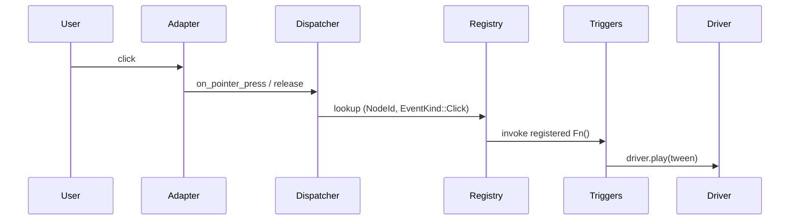

# `AnimationTriggers` — wire pointer events to animations

> Disney's "anticipation" and "follow-through" make a button-press
> feel substantial. `AnimationTriggers` is the sugar that wires
> `Pointer<Click>` to a `Driver::play(...)` call.

## Disney's 12 Principles (1981)

In 1981, two legendary Disney animators — Frank Thomas and Ollie
Johnston — published *The Illusion of Life: Disney Animation*, a
book distilling fifty years of studio craft into twelve numbered
principles. The list is one of the great instruction manuals in any
visual medium. Principle #1 is *squash and stretch*: when a ball
hits the ground, it flattens before bouncing back. Principle #2 is
*anticipation*: before a character swings a bat, they wind back —
your eye reads the wind-back as "something is about to happen."
Principle #6 is *slow in and slow out*: motion accelerates and
decelerates, never starts or stops abruptly. Principle #7 is *arcs*:
natural movement traces curves, not straight lines.

The reason a click-to-trigger button in software UI *feels good* is
that someone applied these principles. The button pre-shrinks
slightly when pressed (anticipation), then springs back beyond its
rest size before settling (squash-and-stretch + follow-through). The
whole motion takes 200–400 ms and lives on a spring curve, not a
linear ramp (slow in / slow out). That's what `AnimationTriggers`
wires up — the *connection* between "user clicked" and "Driver,
play the bounce tween" — without requiring a dependency from
`wisp-animation` to `wisp-interaction`.

## Why glue lives here, not in `wisp-animation`

```admonish important title="Avoiding a dep cycle"
The original ticket spec called for `Tween::on_click_of(node)`
directly on `wisp_animation::Tween`. That requires `wisp-animation
→ wisp-interaction` in the dep graph — every consumer of
`wisp-animation` would inherit a dependency on input handling.

We flip the direction. `AnimationTriggers` lives in
`wisp-interaction`. You wire it to a `Driver` you own; the trigger
fires a no-arg closure that calls whatever animation API you want.
Zero new deps in `wisp-animation`.
```

## Shape



`AnimationTriggers` is a thin wrapper over `CallbackRegistry`. It
exposes ergonomic methods (`on_click`, `on_hover_enter`,
`on_press_release`, `on_drag`) that take no-arg closures the host
can wire to anything.

## `Cooldown` debouncer

```admonish warning title="Click-spam restarts tween mid-flight"
A 400 ms bounce tween restarts on every click. Spam the button
five times in 400 ms and the tween restarts five times — the
visual reads as jerky.

`Cooldown::new(interval_secs, action)` wraps your action with a
minimum-interval gate: drop calls that arrive within `interval` of
the last accepted one. Material Design's tap-feedback default is
300 ms; that's a reasonable starting point.
```

## Quickstart

```rust
# use std::cell::Cell;
# use std::rc::Rc;
use wisp_interaction::{AnimationTriggers, CallbackRegistry, Cooldown, cooldown_action};
# let mut registry = CallbackRegistry::new();
# let my_button_node = wisp::scene::Stage::new().root();

// Simple: no debounce.
{
    let mut t = AnimationTriggers::new(&mut registry);
    t.on_click(my_button_node, move || {
        // driver.play(bounce_tween);
    });
}

// Anti-spam with a 300ms gate. Replace `now_secs` with your monotonic clock.
let now_secs = Rc::new(Cell::new(0.0_f32));
{
    let cooldown = Rc::new(Cooldown::new(0.3, move || {
        // driver.play(bounce_tween);
    }));
    let clock = now_secs.clone();
    let action = cooldown_action(cooldown, move || clock.get());
    let mut t = AnimationTriggers::new(&mut registry);
    t.on_click(my_button_node, action);
}
```

## Hover, press-release, drag

The triggers cover the three other Disney-principle patterns:

- **Hover preview** — `on_hover_enter` / `on_hover_leave` fade a
  preview tooltip in/out. Anticipation principle: the tooltip
  pre-appears as the cursor approaches.
- **Press-and-hold** — `on_press_release` toggles state on
  press, releases on lift. Mute / unmute, momentary buttons.
- **Drag-to-trigger** — `on_drag` fires `start` when the press
  promotes past the 5px threshold, `end` on release. Pull-to-refresh,
  swipe-to-dismiss.

All four wire through the same `CallbackRegistry`. Drop down to
the registry directly if you need access to the full `Pointer<E>`
payload (the event's `local_pos`, modifier state, etc.).
