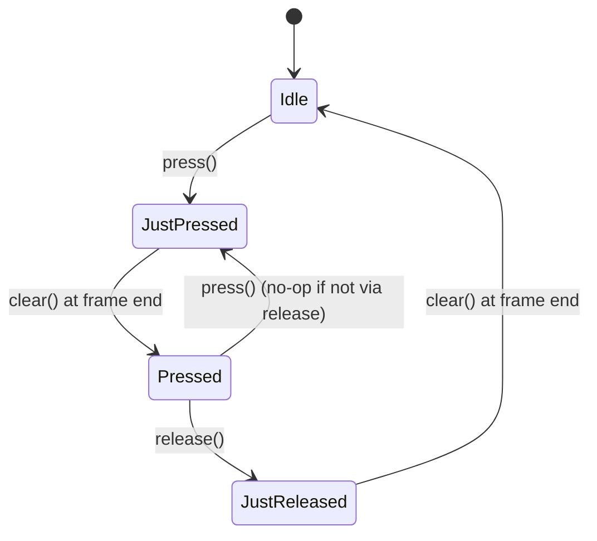

# `ButtonInput<T>` — three-set keyboard / mouse state

> Hold W to walk; press space to jump. The same data shape covers both.

## Hunt the Wumpus (1972)

In 1972, Gregory Yob — a Bay Area programmer in his early twenties —
wrote *Hunt the Wumpus* on a Hewlett-Packard timesharing system in
BASIC. The player navigated a 20-room dodecahedron, hunting a
sleeping monster called the Wumpus while avoiding super-bats and
bottomless pits. The control surface was a single keyboard. Each
move was a *press*: type `M 14`, hit Enter, and your hunter walked
to room 14. Each shot was a press too: `S 1 2 3` for an arrow that
ricochets through rooms 1, 2, and 3.

Wumpus was the first widely-played game with sustained keyboard
input. The grammar it introduced — "press a key, something happens"
— is still the bottom layer of every input system today. Modern
games add a second grammar: "hold a key, something *keeps* happening."
The two grammars are what `ButtonInput<T>` collapses into one data
shape: three sets — `pressed`, `just_pressed`, `just_released` —
that any per-frame code can query.

## The three-set state machine



- **`pressed(key)`** — true for every frame the key is held.
- **`just_pressed(key)`** — true ONLY for the single frame the press
  arrived.
- **`just_released(key)`** — true ONLY for the single frame the
  release arrived.

Auto-repeat (the OS-driven re-fire when you hold a key) is filtered
out of `just_pressed` so "jump on press" doesn't repeat.

```admonish tip title="When to use each"
- "Walk while held" → `if input.pressed(KeyCode::KeyW) { ... }`
- "Jump on press" → `if input.just_pressed(KeyCode::Space) { ... }`
- "Show release feedback" → `if input.just_released(KeyCode::Mouse0) { ... }`

Reach for the raw `InputEvent` stream only when you need auto-repeat
filtering, IME / text input, or per-event timestamps. The 80% path
is the three-set state.
```

## API

```rust
use wisp_interaction::{ButtonInput, KeyCode};

let mut keys = ButtonInput::<KeyCode>::default();

// Adapter fills it from raw events:
keys.press(KeyCode::KeyW);
assert!(keys.pressed(KeyCode::KeyW));
assert!(keys.just_pressed(KeyCode::KeyW));

// Game loop clears `just_*` sets at frame end:
keys.clear();
assert!(keys.pressed(KeyCode::KeyW));        // still held
assert!(!keys.just_pressed(KeyCode::KeyW));  // already consumed

keys.release(KeyCode::KeyW);
assert!(keys.just_released(KeyCode::KeyW));
assert!(!keys.pressed(KeyCode::KeyW));
```

## Why a side-table per kind?

`ButtonInput<T>` is generic so the same shape handles keyboards,
mouse buttons, and gamepad buttons under one mental model. Type
aliases ship for the two we have today:

- `KeyboardInput = ButtonInput<KeyCode>`
- `MouseButtonInput = ButtonInput<MouseButton>`

Gamepads land later (no consumer yet — a `GamepadButton` enum +
`ButtonInput<GamepadButton>` alias suffices).
