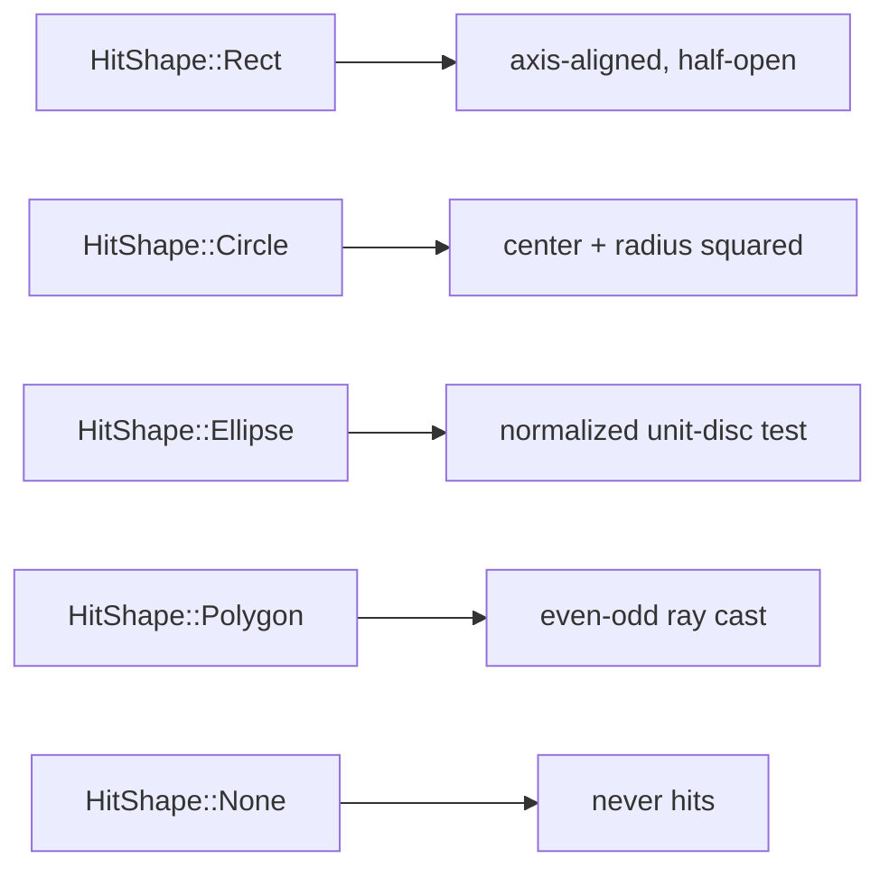

# `HitTestBackend` — what did the user click?

> Rect, circle, ellipse, polygon. Even-odd fill rule for the bucket
> fill. Side-table keyed by NodeId so `wisp` stays interaction-free.

## MacPaint (1984)

In January 1984, Bill Atkinson shipped *MacPaint* on the original
128K Macintosh. The bitmap-editor demo that made it famous was the
*paint bucket* — click any enclosed region, and that region floods
with the current fill colour. Atkinson's flood-fill ran in real
time on a 7.83 MHz 68000 CPU with 22 KB of free RAM.

The bucket tool was the first mass-market answer to a question that
sounds simple: *which region did the user click in?* The naive
answer — "the topmost pixel under the cursor" — doesn't work,
because the user's click might land *between* pixels of an outline.
The right answer needs *containment*: walk the scene, find every
shape whose interior contains the click point, sort by drawing
order, return the topmost.

```admonish info title="Why even-odd fill rule"
MacPaint's bucket fill assumed regions were bounded by a contiguous
outline (start at the click, paint outward until you hit a black
pixel). For vector geometry we go further: a polygon with a *hole*
in it (an outer rectangle minus an inner one) should treat the hole
as outside, not inside.

The rule that gives you "holes count" is **even-odd fill**: cast a
horizontal ray from the click point to infinity; count edges
crossed; *inside* iff the count is odd. The same rule SVG implements
as `fill-rule: evenodd`. We use it for `HitShape::Polygon` so an
L-shape's notch is treated as exterior.
```

## The four shape variants



Each variant has a `contains(local_point) -> bool` that does the
math in local coordinates. The backend transforms the viewport
pointer into each node's local space (via the inverse of its world
matrix) before testing.

## Two backends from one trait

```rust
pub trait HitTestBackend {
    fn pick(&self, viewport_pointer: Vec2) -> Vec<Hit>;
}
```

- **`Wisp2dHitTest::new`** — linear scan over every pickable. Right
  for scenes with ≤100 pickable nodes.
- **`Wisp2dHitTest::with_index`** — `rstar` R-tree spatial index.
  Right for scenes with hundreds of pickable nodes (chart points,
  treemap cells). Same `pick()` results — just the lookup cost
  changes from `O(P)` to `O(log P + K)`.

The R-tree's fast-path rejects nodes whose world-AABB doesn't
contain the pointer; survivors run the precise `HitShape::contains`
test as a second pass.

## `Pickable` lives in a side-table

```admonish important title="Why we don't put pickable on wisp::Node"
The `wisp` crate is published to crates.io as `screen-wisp`. Adding
a `pickable: bool` field (or anything richer) to `wisp::Node` would
force every downstream consumer of `screen-wisp` to think about
interaction — even consumers who only want a 2D renderer. So
pickable nodes live in `PickableMap`: a separate `HashMap<NodeId,
Pickable>` you build and pass to the backend.

The cost is one `HashMap` probe per pickable during backend
construction. The benefit is that `wisp` stays interaction-free
forever.
```

## Hit ordering: topmost first

`Hit { node, depth, local_pos }` is the per-result payload. The
backend assigns `depth` as a monotonically increasing counter during
pre-order stage traversal — the LAST drawn node gets the HIGHEST
depth — and sorts hits descending on `depth` before returning. So
`hits[0]` is always the topmost.

## Quickstart

```rust
use glam::Vec2;
use wisp_interaction::{
    HitShape, HitTestBackend, PickableMap, Wisp2dHitTest,
};
use wisp::math::Rect;
use wisp::scene::{Container, Stage};

let mut stage = Stage::new();
let n = stage.add_child(stage.root(), Container::new()).unwrap();

let mut pickable = PickableMap::new();
pickable.insert_shape(n, HitShape::Rect(Rect::new(0.0, 0.0, 50.0, 50.0)));

let backend = Wisp2dHitTest::new(&stage, &pickable);
let hits = backend.pick(Vec2::new(25.0, 25.0));
assert_eq!(hits[0].node, n);
```
