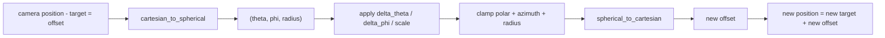
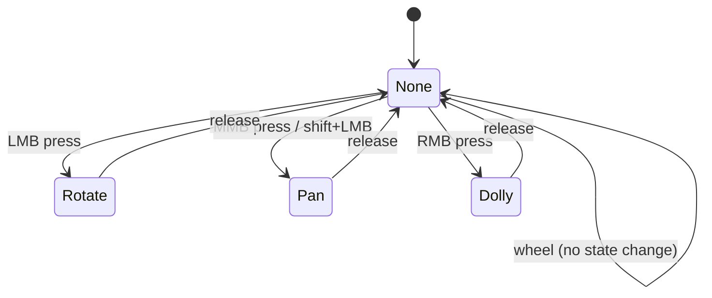

# `OrbitController` — orbit around a target

> Three.js's `OrbitControls.js` ported to Rust. Spherical math,
> damping, dolly clamps, auto-rotate. Generic over a `Camera3D`
> trait so it doesn't drag a `wisp-3d` dep into `wisp-interaction`.

## Pixar's Luxo Jr. (1986)

In 1986, John Lasseter — then a young animator at the newly-spun-off
*Pixar Animation Studios* — directed a two-minute short called *Luxo
Jr.* Two desk lamps appear on a flat surface. The larger one looks
on as the smaller one bounces a ball. The smaller lamp jumps, lands,
chases, deflates with sadness when the ball pops, then springs up
with renewed energy when it spots a much bigger ball. The film won
no Oscars but did get nominated — and it permanently established
that *an inanimate object can have a personality* if you film it
right.

The film's secret weapon was the *orbit camera*. The shots that
make Luxo Jr. feel like a real animated being — the dramatic angle
when the small lamp leaps, the slow circle around the deflated
lamp on the ground — were possible because the rendering team built
a control rig that orbited a virtual camera around a fixed target
point. Three.js's `OrbitControls.js`, the modern web-standard
implementation, traces a direct lineage to that 1986 rigging math.
Our `OrbitController` is a Rust port of `OrbitControls.js` r170 —
same state machine, same spherical-coord math, same damping
behaviour you've felt every time you've dragged a 3D model in
Sketchfab or Google Earth.

## The spherical-coords trick



Don't move the camera in cartesian space — convert its offset from
the target into spherical coords (`theta` = azimuth, `phi` = polar
from +Y), apply the accumulators, clamp, convert back. The user's
drag gestures change `theta` and `phi`; wheel-zoom changes `radius`;
middle-drag changes `target`.

## State machine



Each state owns one accumulator: `delta_theta + delta_phi` (rotate),
`pan_offset` (pan), `scale` (dolly). `update()` applies them in one
pass, clamps, and (if `enable_damping`) decays them by
`damping_factor` per frame so motion continues briefly after the
user lifts their finger.

## Generic over `Camera3D`

```admonish important title="No wisp-3d dep"
The controller mutates whatever camera struct you own — we define
a minimal `Camera3D` trait locally:

```rust
pub trait Camera3D {
    fn position(&self) -> Vec3;
    fn target(&self) -> Vec3;
    fn up(&self) -> Vec3;
    fn set_position(&mut self, p: Vec3);
    fn set_target(&mut self, t: Vec3);
    fn fov_y(&self) -> f32 { 60.0_f32.to_radians() }
}
```

Hosts impl this for `wisp_3d::Camera3D` at the integration seam
(`wisp-interaction-web`, the recorder app). Keeps the publish-dep
direction `wisp → wisp-interaction → host`, never the reverse.
```

## Quickstart

```rust
use glam::Vec2;
use wisp_interaction::OrbitController;

let mut ctrl = OrbitController::new();
ctrl.enable_damping = true;
ctrl.min_distance = 2.0;
ctrl.max_distance = 50.0;
ctrl.auto_rotate = true;  // slow auto-spin while idle

// Per frame (host wires from its winit / web adapter):
// ctrl.pointer_down_rotate(viewport_pos);
// ctrl.pointer_drag(viewport_pos, viewport_size, distance, right, up, fov_y);
// ctrl.pointer_up();
// ctrl.wheel(y_delta);

// At render time:
// let changed = ctrl.update(&mut camera, dt_secs);
// if changed { re_render(); }
```

## What we skipped (and why)

- **Keyboard arrow-key panning** — no consumer asking; trivial to add.
- **Touch pinch / two-finger** — the host's pointer adapter synthesises
  controller calls from `PointerId::Touch` pairs (see `adapters.md`).
- **Dolly-to-cursor** — `PanZoomController` covers the 2D version;
  the 3D version requires per-frame pivot recalculation against a
  ground plane and isn't useful for the recorder's editor scene.
