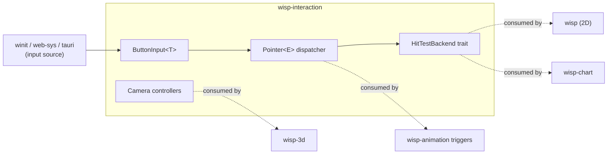

# `wisp-interaction` overview

`wisp-interaction` is the input + hit-test + camera-controller layer for the wisp family. It does NOT add input handling to each library individually — that produces N inconsistent APIs. It owns the vocabulary once.

```admonish important title="WI.0 is the skeleton"
This chapter is the placeholder companion to WI.0 (AUT-303) — the crate skeleton commit that pins the public path conventions. The full surface (keyboard / mouse / pointer / hit-test / orbit / pan-zoom / adapters / animation triggers) lands across WI.1..WI.11 with their own chapters and live iframe examples.
```

## Where it fits



## The three engines we cross-referenced

We built `wisp-interaction` after deep research on PixiJS v8, Three.js r170+, and Bevy 0.18. The full memos live in the [`wisp-interaction` Linear project](https://linear.app/harwood/project/wisp-interaction-cf9a6b07ec52)'s WI.0 ticket description. The synthesis:

| Concern | Pattern adopted | Source |
|---|---|---|
| Keyboard / mouse-button state | `ButtonInput<T>` with three sets (`pressed` / `just_pressed` / `just_released`) generic over key kind | Bevy `crates/bevy_input/src/button_input.rs:12-60` |
| Pointer event taxonomy | `Pointer<E>` typed enum (15 variants: `Over` / `Out` / `Press` / `Release` / `Click` / `Move` / `Drag*` / `Scroll` / `Cancel`) | Bevy `crates/bevy_picking/src/events.rs:139-340` |
| Multi-touch state | `PointerId::{Mouse, Touch(u64), Custom(u128)}` keying every dispatch stage | Bevy `pointer.rs:32-46` |
| Drag without OS pointer-capture | Press-path bookkeeping (remember the ancestor chain at press, replay at release) | PixiJS `src/events/EventBoundary.ts:677-708, 1092-1133` |
| Cursor style | Stored on node, applied to host via callback indirection | PixiJS `EventSystem.ts:539-590` |
| 3D orbit camera | Spherical-coords state machine + damping + touch handlers | Three.js `examples/jsm/controls/OrbitControls.js` |
| Hit-test backend trait | Backend emits `(NodeId, HitData)` lists; core sorts + dedupes | Bevy `crates/bevy_picking/src/backend.rs:60-85` |

Explicit non-goals:

- **No ECS dependency.** Bevy proves observers are great UX; porting Bevy's archetype machinery into wisp is not. Closure-on-NodeId registration is the equivalent.
- **No 3-phase DOM event propagation.** Bubble-only. The capture phase is a DOM artifact that adds complexity without payoff for non-DOM scene graphs.
- **No 5-state `eventMode` enum.** Bevy's orthogonal 2-bit `Pickable { should_block_lower, is_hoverable }` captures the same semantics with less ceremony.
- **No brute-force per-triangle ray scan.** When a wisp-3d picking backend lands (follow-up), it'll need a BVH from day one — Three.js's naive Möller-Trumbore brute scan is a known footgun for any non-trivial mesh.

## Quickstart (preview)

```rust,no_run
# // The API is sketched here; cells WI.1..WI.7 fill in the
# // implementation, and WI.10 ships live iframe examples.
use wisp_interaction::Application;

# async fn demo() -> anyhow::Result<()> {
let _app = Application::new(Default::default()).await?;
// In WI.1 we add: let mut keys = KeyboardInput::default();
// In WI.2 we add: let mut dispatcher = PointerDispatcher::new();
// In WI.4 we add: let mut orbit = OrbitController::new(camera);
// In WI.6 we add: let adapter = WinitAdapter::new(...);
// In WI.10 we ship iframe-embedded examples for each of the above.
# Ok(())
# }
```

## Read next

This chapter is the architecture summary. The detailed surface lands in:

- `button-input.md` — `ButtonInput<T>` state machine (Hunt the Wumpus 1972 historical narrative)
- `pointer-events.md` — `Pointer<E>` taxonomy + dispatcher (Sketchpad 1963)
- `hit-test.md` — `HitTestBackend` + `Wisp2dHitTest` (MacPaint bucket fill 1984)
- `orbit-controller.md` — Three.js port (Pixar Luxo Jr. 1986)
- `pan-zoom-controller.md` — Figma-style zoom-around-pointer (Eames Powers of Ten 1977)
- `adapters.md` — winit + web-sys (pointer-event lineage 1968→2013)
- `animation-triggers.md` — Pointer → Tween (Disney 12 Principles 1981)
