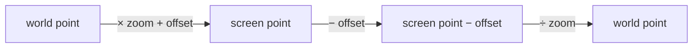

# `PanZoomController` — 2D pan + zoom-around-pointer

> Figma + Google Maps math. Drag pans, wheel zooms with the cursor
> as the anchor point.

## Charles & Ray Eames, *Powers of Ten* (1977)

In 1977, the design duo Charles and Ray Eames released a nine-minute
educational film called *Powers of Ten*. The film opens on a couple
having a picnic in a Chicago park — a square frame measuring one
meter across. Every ten seconds the camera zooms out by a factor of
ten. Ten meters across. A hundred meters. The Earth from low orbit.
The solar system. The Milky Way. The local galactic group. Forty
seconds in, the frame measures `10²⁴` meters — the observable
universe. Then the camera reverses, zooming back through the same
scale chain, past the picnic blanket, into a hand, into a cell, a
nucleus, an atom, a proton — `10⁻¹⁶` meters and ten million times
smaller than where we started.

The Eameses' point was that *spatial reasoning across scales* is one
of human cognition's most important abilities and one of its most
neglected affordances. Modern infinite-canvas tools — Figma, Miro,
Sketch, the recorder's editor surface — exist because Powers of Ten
made the case that fluid pan + zoom isn't just a UI nicety; it's
how you reason about anything that has structure at multiple scales.
`PanZoomController` is the math behind that fluid behaviour.

## The zoom-around-pointer trick

```admonish important title="The math nobody writes down"
The non-obvious step: when the user spins their wheel, you don't
just change `zoom`. The world point under the cursor must stay
under the cursor through the entire zoom. Otherwise the canvas
"jumps" away from the cursor at every notch — the cardinal sin of
pan/zoom UI.

The fix is two lines of math:

```rust
let world_pivot = viewport.screen_to_world(pivot);
let new_zoom = (viewport.zoom * factor).clamp(min, max);
viewport.zoom = new_zoom;
viewport.offset = pivot - world_pivot * new_zoom;
```

Take the world point under the cursor BEFORE the zoom. Change the
zoom. Solve `offset` so that the same world point lands under the
same pixel cursor AFTER the zoom. Done.
```

## The transform



A `Viewport2D { offset, zoom }` represents a world-to-screen
transform via `screen = world * zoom + offset`. `screen_to_world`
is the inverse. The controller mutates this struct in response to
host input.

## Inputs the controller wires

| Input | Method | Effect |
|---|---|---|
| Pan-button press | `pan_begin(pointer)` | Record anchor |
| Pointer move while panning | `pan_drag(pointer, &mut vp)` | Translate `offset` by delta |
| Pan-button release | `pan_end()` | Clear anchor |
| Wheel rotation | `wheel_zoom(pivot, y_delta, &mut vp)` | Zoom around pivot |
| Pinch gesture | `zoom_at_pointer(pivot, factor, &mut vp)` | Zoom around pivot |

`y_delta < 0` (browser convention: scroll up) zooms in; `y_delta > 0`
zooms out. The host's adapter normalises whichever sign convention
the source uses.

## Quickstart

```rust
use glam::Vec2;
use wisp_interaction::{PanZoomController, Viewport2D};

let mut ctrl = PanZoomController::new();  // Figma defaults
let mut viewport = Viewport2D::identity();

// Pan with middle mouse:
ctrl.pan_begin(Vec2::new(100.0, 100.0));
ctrl.pan_drag(Vec2::new(150.0, 200.0), &mut viewport);
ctrl.pan_end();

// Zoom around cursor (wheel up):
ctrl.wheel_zoom(Vec2::new(300.0, 200.0), -1.0, &mut viewport);
// World point under (300, 200) is still under (300, 200) after zoom.
```

## Clamps

The controller exposes `min_zoom: 0.01` and `max_zoom: 100.0` by
default — Figma-equivalent. Tighten for chart canvases that don't
want users zooming past readability; loosen for the recorder's
editor surface where the user might want a full-document overview.
