# `Pointer<E>` — typed pointer events

> Click, drag, hover, scroll. 15 typed variants. One dispatcher.
> Bubble walks the scene tree until a handler calls `stop_bubble()`.

## Sketchpad (1963)

In 1963 Ivan Sutherland defended his MIT PhD thesis with a working
program called *Sketchpad*. The demo showed a young man at a TX-2
mainframe holding a *light pen* — a stylus the size of a pencil
wired to a vacuum-tube display. He drew a line on the screen with
the pen. He drew another. He pointed at the first line and made it
*horizontal*. Then he selected both lines and constrained them to
be the same length. As he dragged one endpoint, both lines updated
in real time.

Sketchpad introduced two ideas that *Pointer<E>* still implements
sixty years later. The first was direct manipulation — the user
touches the scene with a pointer and the scene responds, instantly,
without typing commands. The second was *typed input events*:
Sutherland's program distinguished a pen-down (start a new line) from
a pen-drag (continue the current line) from a pen-tap (select an
existing object). Each was a different code path. The exact same
distinction is why our event enum has separate `Press`, `Drag`, and
`Click` variants instead of one polymorphic "pointer happened"
callback.

## The 15-variant taxonomy

```mermaid
flowchart TD
    A[pointer enters target] --> Over
    B[pointer leaves target] --> Out
    C[pointer moves while over] --> Move
    D[OS cancelled] --> Cancel
    E[button down] --> Press
    F[button up on press path] --> Release
    G[press + release on same target] --> Click
    H[press + 5px move] --> DragStart
    I[motion while dragging] --> Drag
    J[release while dragging] --> DragEnd
    K[wheel rotated] --> Scroll
    L[drag enters another node] --> DragEnter
    M[drag is over another node] --> DragOver
    N[drag leaves another node] --> DragLeave
    O[drag released over target] --> DragDrop
```



15 variants because the *kind* of pointer event determines what the
handler is doing — a click handler shouldn't fire on a stray hover
move, and a drag handler shouldn't fire on a single click.

## Press-path bookkeeping (PixiJS pattern)

```admonish important title="Why the dispatcher tracks the press path"
A common bug in naive event systems: user presses on button A,
drags off the button, releases on the background. Naive code emits
*Release* on the background — but the *press* fired on A, so logically
the *release* should fire on A too (so the button can un-highlight).

We solve this with the **press-path bookkeeping** pattern from
PixiJS's `EventBoundary.ts:677-708`: at press time, record the
ancestor chain of the target node. At release time, replay the
release on that recorded chain regardless of where the pointer
landed. Same for `DragEnd`.

The downside is one `HashMap` of state per `PointerId`. The upside is
draggable UI elements that survive the pointer leaving the host
canvas entirely (a frequent web-browser failure mode).
```

## Stop bubbling — interior mutability via `Cell<bool>`

`Pointer<E>` carries a `Cell<bool>` `bubble_stopped` flag. Handlers
have `Fn(&Pointer<E>)` signature (no `&mut`), but they can still
halt ancestor dispatch by calling `event.stop_bubble()`. The
dispatcher reads the flag after each handler and returns early if
set.

## Quickstart

```rust
use wisp_interaction::{
    CallbackRegistry, Click, Pointer, PointerId,
};

let mut registry = CallbackRegistry::new();
registry.on_click(my_button_node, |e: &Pointer<Click>| {
    println!("clicked on {:?} at {:?}", e.target, e.location.viewport);
    e.stop_bubble();  // parent handlers won't fire
});
```

## Multi-touch is free

`PointerId::{Mouse, Touch(u64), Custom(u128)}` keys the per-pointer
state map. Two fingers on a touchscreen produce two distinct press
paths — two clicks total, not one merged "average" click. The
dispatcher walks each independently.
