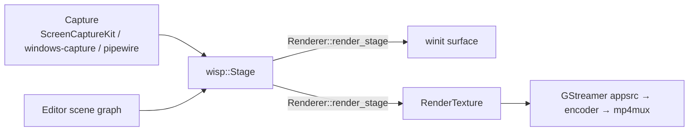

# Wisp at a glance

`wisp` is the in-repo 2D renderer that powers Screen Studio's
preview, recording HUD, and export pipeline. It's a Pixi-shaped
public API on top of `wgpu`: scene tree, sprite batcher, filter
chain, mask system, text.

## How it fits



Wisp owns the visual composition; everything around it (capture,
encode, UI) talks to it via the same scene tree. The editor preview
and the export pipeline render the **same** `Stage` — preview to a
window surface, export to a `RenderTexture`.

## Where to read more

The deep dive lives in its own book — every chunk chapter, filter
pass, mask permutation, and text variant is documented there:

→ **[Wisp book](/screen/wisp/)** — Pixi-shaped API tour,
~50 chunk chapters, text architecture, mask system, headless
export, full quickstart.

If you're contributing **to the recorder** (Tauri shell, capture
pipeline, editor surfaces, ui-storybook components), the rest of
this project book is the right place. If you're using **wisp as a
library** in some other wgpu app, the wisp book is the standalone
reference.

## Why a separate book

The wisp crate is publishable to crates.io independent of the
recorder. External consumers want a focused reference — the
recorder's Tauri integration, capture pipeline, Leptos UI, and
storybook discipline are all noise to them. Splitting the books
keeps each one short for its actual audience.

The two books share an origin
(`eng-manager-xyz.github.io/screen/`) and cross-link freely. The
{{wisp-link …}} preprocessor tag ensures cross-references resolve
correctly in both books (relative in wisp, absolute in screen).
See `_docs/shared/` for shared content fragments.

```admonish info title="Cross-link convention"
- Project ↔ wisp: absolute URLs (`/screen/wisp/...` or `/screen/...`).
- Within either book: relative paths (`./chunks/blur.md`).
- The `mdbook-preprocessor-cross` preprocessor enforces this so
  shared content fragments resolve correctly per-book.
```
