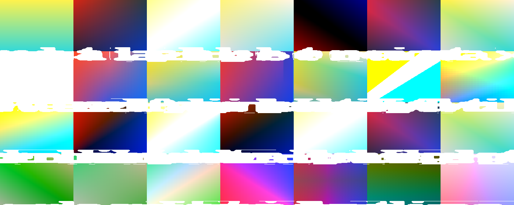

# Blend modes — M-BLEND.1



The full PixiJS v8 catalog, implemented in two architectural buckets:

- **Standard** (8 modes) — single-pass GPU blend equations via
  `wgpu::BlendState`. Free.
- **Advanced** (20 modes) — offscreen filter pass that samples
  backdrop + foreground and runs a per-mode blend shader. One extra
  render-target per advanced-blended node.

## Catalog

| Mode | Bucket | Formula |
|---|---|---|
| `normal` | standard | `src.a · src + (1 - src.a) · dst` |
| `multiply` | standard | `dst · src + (1 - src.a) · dst` |
| `add` | standard | `src + (1 - src.a) · dst` |
| `screen` | standard | `1 - (1 - src) · (1 - dst)` |
| `subtract` | standard | `dst - src` (clamped) |
| `min` | standard | `min(src, dst)` per channel |
| `max` | standard | `max(src, dst)` per channel |
| `erase` | standard | `dst · (1 - src.a)` |
| `overlay` | advanced | `(base < 0.5) ? 2·base·blend : 1 - 2·(1-base)·(1-blend)` |
| `hard-light` | advanced | overlay with the test on `blend` instead of `base` |
| `soft-light` | advanced | W3C piecewise (smoother than hard-light) |
| `pin-light` | advanced | `(blend < 0.5) ? min(base, 2·blend) : max(base, 2·blend - 1)` |
| `hard-mix` | advanced | `step(0.5, base + blend - 0.5)` |
| `vivid-light` | advanced | combination of color-burn (low blend) + color-dodge (high blend) |
| `linear-light` | advanced | `base + 2·blend - 1` clamped |
| `color-burn` | advanced | `1 - min(1, (1 - base) / blend)` |
| `color-dodge` | advanced | `min(1, base / (1 - blend))` |
| `linear-burn` | advanced | `base + blend - 1` clamped |
| `linear-dodge` | advanced | `base + blend` clamped |
| `darken` | advanced | `min(base, blend)` |
| `lighten` | advanced | `max(base, blend)` |
| `difference` | advanced | `abs(base - blend)` |
| `exclusion` | advanced | `base + blend - 2·base·blend` |
| `negation` | advanced | `1 - abs(1 - base - blend)` |
| `divide` | advanced | `clamp(base / blend, 0, 1)` |
| `saturation` | advanced (HSL) | `set_lum(set_sat(base, sat(blend)), lum(base))` |
| `color` | advanced (HSL) | `set_lum(blend, lum(base))` |
| `luminosity` | advanced (HSL) | `set_lum(base, lum(blend))` |

## API

### Standard modes

Set on the node's container; rendered automatically in `render_stage`:

```rust
let mut graphics = Graphics::new();
graphics.fill(Fill::Solid(Color::rgba(1.0, 0.0, 0.0, 1.0)));
graphics.draw_rect(Rect::new(-1.0, -1.0, 2.0, 2.0));
graphics.container.blend_mode = BlendMode::Multiply;  // ← here
```

Each [pipeline](../../api/wisp/render/index.html) (`sprite`, `graphics`,
`text`, `mesh`) holds a [`BlendPipelineMap`](../../api/wisp/render/index.html)
of one [`wgpu::RenderPipeline`](https://docs.rs/wgpu/24/wgpu/struct.RenderPipeline.html)
per native mode (8 pipelines per shader pre-built at construction time).
Drawing groups instances by `(texture, blend_mode)` and binds the right
pipeline for each batch.

### Advanced modes

Manual two-RT compositing — `render_stage` falls back to Normal for
advanced modes (with a `tracing::warn!` once per mode) because automatic
backdrop sampling isn't yet wired through the renderer. The explicit API:

```rust
renderer.apply_advanced_blend(
    &app,
    BlendMode::Overlay,
    &backdrop_rt,    // already-rendered destination
    &foreground_rt,  // this node's contribution
    &output_rt,
);
```

The backdrop and foreground are pre-rendered separately. The
[`apply_advanced_blend`](../../api/wisp/render/struct.Renderer.html#method.apply_advanced_blend)
call binds the right shader (one of 20 pre-built at `Renderer::new` time)
and writes the composite to `output_rt`.

## Shader template

All 20 advanced modes share a single template at
`crates/wisp/shaders/advanced_blend.wgsl`. The Rust resolver in
[`render/advanced_blend.rs`](../../api/wisp/render/index.html) substitutes
a per-mode `blend_fn(base, blend) -> vec3<f32>` snippet at pipeline
construction. The template handles:

- Fullscreen-triangle vertex shader.
- Texture + sampler bindings for backdrop + foreground.
- HSL helpers (`lum`, `clip_color`, `set_lum`, `sat`, `set_sat`) used by
  the `saturation` / `color` / `luminosity` trio.
- Output compositing: `mix(backdrop, blended, foreground.a)` for RGB +
  source-over alpha.

## Tests

The catalog is exhaustively tested:

- `crates/wisp/tests/blend_modes_standard.rs` — 8 tests, one per native
  mode. Asserts center-pixel readback after compositing red over blue (or
  similar known-input pair).
- `crates/wisp/tests/blend_modes_advanced.rs` — 20 tests, one per
  advanced mode. Each picks input colors that yield a deterministic,
  human-checkable expected output (with a 2-LSB tolerance for GPU
  rounding variance).

## Pivot from PixiJS

The implementation maps closely onto PixiJS's `pixi.js/advanced-blend-modes`
sub-export. Two intentional simplifications:

- **No automatic dispatch in the scene-graph renderer.** Setting
  `container.blend_mode = BlendMode::Overlay` on a sprite and calling
  `render_stage` produces a *Normal*-blended result with a tracing
  warning. Future work: `render_stage` walks the tree, batches
  advanced-blend nodes into per-node offscreen RTs, and chains
  `apply_advanced_blend` automatically.
- **Single template, not 20 separate shader files.** PixiJS ships each
  advanced mode as its own `.ts` file with a parallel WGSL/GLSL
  fragment. We share a template and inject `blend_fn` per mode at
  pipeline construction. Smaller surface, equivalent runtime cost.

## Generate the contact sheet

```bash
cargo run -p wisp --example blend_modes_gallery
# writes _docs/book/src/assets/wisp/blend-modes.png
```

Background gradient is red → blue (horizontal); foreground gradient is
yellow → cyan (vertical). Each tile shows the composite for one mode,
with the kebab-case label overlaid in white.
