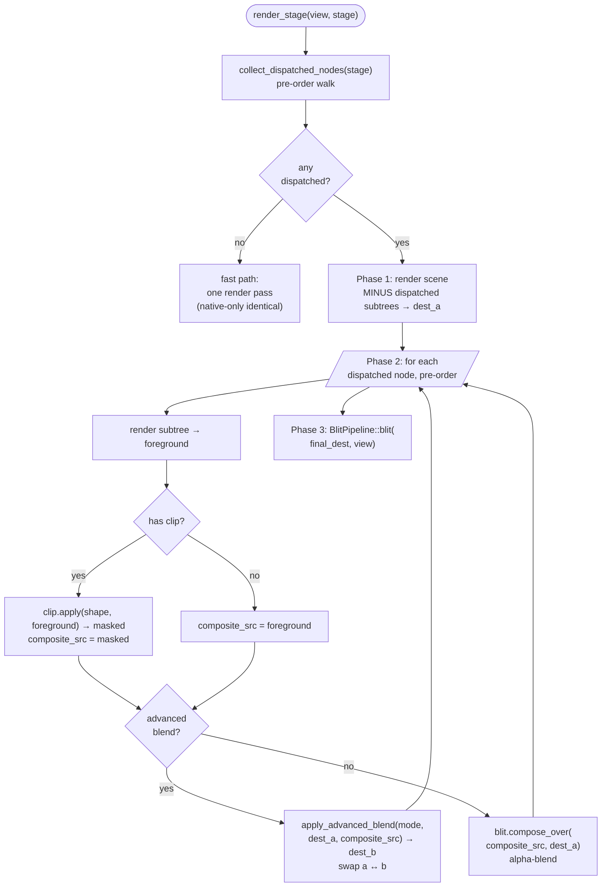

# Rounded crop / mask foundation

[Linear: AUT-31](https://linear.app/harwood/issue/AUT-31)


The first mask primitive in `wisp` — and the foundation every later
mask issue (AUT-20 through AUT-35) extends.

## What landed

- New [`MaskShape`](../../api/wisp/scene/clip/enum.MaskShape.html) enum
  in `crates/wisp/src/scene/clip.rs`. Today's only variant is
  `RoundedRect { rect, radius }`. Future variants (Circle, Ellipse,
  Path) come from later issues.
- New [`Container::clip: Option<MaskShape>`](../../api/wisp/struct.Container.html)
  field. Defaults to `None` — fast-path renders are unchanged.
- New `crates/wisp/shaders/clip.wgsl` — fragment shader that samples a
  foreground RT and multiplies the alpha by the rounded-rect SDF.
- New `crates/wisp/src/render/clip.rs` — pipeline that runs the shader
  with per-call uniforms.
- Renderer reshape: the slow-path dispatcher (which already handled
  Tier-C advanced blends from M-BLEND.2) now also handles clipped
  containers.

## Architecture

`Container::clip` plugs into the M-BLEND.2 dispatch model. A node is
"dispatched" if it has an advanced blend mode OR a clip set. Both
trigger the offscreen path:



A container with BOTH a clip AND an advanced blend mode does the clip
first, then the advanced composite. Order matters: the user expects
the advanced math to operate on the masked subtree, not the unmasked
one.

## Coordinate system

`MaskShape::RoundedRect { rect, radius }` is in NDC `[-1, +1]²` —
**screen space, not container-local space**. The recording-quad use
case (a fixed-position recording surface with rounded corners) drove
this. Transform-aware clipping ("clip a moving sprite to its own
bounds") is a future enhancement; today, clip + transform on the same
container produces a clip in screen space and a transformed subtree
inside it.

## SDF anti-aliasing

The mask uses a standard rounded-rectangle SDF:

```wgsl
fn sdf_rounded_rect(p: vec2<f32>, half: vec2<f32>, r: f32) -> f32 {
    let q = abs(p) - half + vec2<f32>(r);
    return length(max(q, vec2<f32>(0.0))) + min(max(q.x, q.y), 0.0) - r;
}

let mask = clamp(0.5 - d / aa, 0.0, 1.0);
return vec4<f32>(fg.rgb, fg.a * mask);
```

`aa` = `2 / min(width, height)` so the AA band spans roughly one
output pixel. Hard edges on cropped photos / video become smooth
without per-call resolution scaling.

## API

```rust
let mut clip_container = Container::new();
clip_container.clip = Some(MaskShape::RoundedRect {
    rect: Rect::new(-0.75, -0.55, 1.5, 1.1),
    radius: 0.14,
});
let clip_id = stage.add_child(stage.root(), Node::Container(clip_container)).unwrap();
let _ = stage.add_child(clip_id, recording_sprite);
```

Or apply a clip to a leaf directly:

```rust
let mut sprite = Sprite::from_texture(tex);
sprite.container.clip = Some(MaskShape::RoundedRect { ... });
let _ = stage.add_child(stage.root(), sprite);
```

## Tests

`crates/wisp/tests/clip_rounded_rect.rs` — 4 pixel-readback cases:

- `center_pixel_is_inside_the_clip` — confirms the masked-in region
  renders the foreground color at full opacity.
- `far_corner_is_outside_the_clip` — confirms a pixel well outside the
  clip rect shows the parent's clear color.
- `pixel_inside_rect_but_outside_corner_radius_is_clipped` — confirms
  the rounded shape is honored, not just the bounding rect.
- `no_clip_renders_normally_via_fast_path` — regression guard that
  scenes without `Container::clip` skip the offscreen dispatch.

## What's next

This foundation unlocks:

- **AUT-20 / AUT-21** — privacy blur masks (rectangle + rounded-rect).
- **AUT-23** — solid redaction (masked fill region).
- **AUT-28** — highlight / spotlight (focus on a region).
- **AUT-29** — dim-outside inverse mask.
- **AUT-30** — webcam circle / rounded-rect (extends `MaskShape`).
- **AUT-34** — oval / ellipse mask.
- **AUT-35** — freehand path mask.

Each one is a thin extension: a new `MaskShape` variant, or a new
filter that reuses this same `apply_clip` plumbing.
