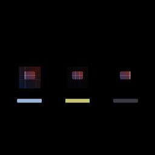

# Dim outside — M-MASK.7 / AUT-29

`DimOutside` + `DimStrength` are the renderer-data API for the
spotlight focus effect. `DimStrength::{Light, Medium, Heavy,
Custom(f32)}` symbolically picks how dark the surrounding context
becomes; `apply_dim_outside_data` is a one-line wrapper over
`apply_spotlight` that passes a black overlay at the right alpha.

```rust
use wisp::{DimOutside, DimStrength, math::Rect};

let focus = Rect::new(-0.5, -0.55, 1.0, 0.7);
let dim = DimOutside::rounded_rect(focus, 0.08)
    .with_strength(DimStrength::Heavy);
renderer.apply_dim_outside_data(&app, &dim, &base, &output);
```

| Variant | Outside alpha | Use |
| --- | --- | --- |
| `Light` | 0.4 | Surrounding still legible. |
| `Medium` (default) | 0.7 | Visibly dimmed but recognizable. |
| `Heavy` | 0.9 | Cinematic spotlight-only. |
| `Custom(f32)` | clamped `[0, 1]` | Exact alpha for stories/tests. |



## Architecture

`DimOutside` is a thin shell over the AUT-28 spotlight primitive. The
*renderer code is unchanged from M-MASK.6*; only the data API and the
strength enum are new. The same observation as `PrivacyBlur`/
`BlurStrength`: editor projects persist a stable name (`Light`,
`Medium`, `Heavy`), and the numeric alpha mapping can be retuned
later without breaking project files.

## Done when

- [x] Surrounding area can be dimmed around a selected region.
- [x] Outside opacity is configurable in renderer data
  (`DimStrength`).
- [x] Preview/headless render parity is preserved (single primitive
  backs both).
- [x] Storybook story `dim-outside` shows three strength variants
  side-by-side.
- [x] `just gate` green.

## API

- [`wisp::DimStrength`](../../api/wisp/scene/dim_outside/enum.DimStrength.html)
- [`wisp::DimOutside`](../../api/wisp/scene/dim_outside/struct.DimOutside.html)
- [`wisp::Renderer::apply_dim_outside_data`](../../api/wisp/render/struct.Renderer.html#method.apply_dim_outside_data)
