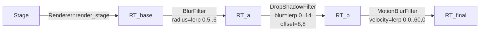

# Filter chain — M0.20


The M0.20 proof point that wisp's [`Filter`](../../api/wisp/filter/trait.Filter.html)
trait composes cleanly when multiple post-processing passes need to stack.

The pipeline:



Three filters in sequence, each fed by the previous filter's output. Each
filter declares `passes()` and the [`Renderer::apply_filter`](../../api/wisp/render/struct.Renderer.html#method.apply_filter)
helper allocates a scratch `RenderTexture` for multi-pass filters
(Blur is two-pass — separable Gaussian; the others are one-pass).

`crates/wisp/examples/filter_chain.rs` animates all three parameters
together over 60 frames so the chain visibly *layers* — the highlight
above is frame 30, where blur radius is 3.25 px, drop-shadow blur is
7 px, and motion-blur kernel is at 50% of `peak_velocity_pps`.

The example is fully headless — same render path the M-EXPORT
pipeline will use when it consumes a project file and emits PNGs
(or pushes BGRA frames into GStreamer's `appsrc → encoder → mp4mux`
graph, per [AUT-144](https://linear.app/harwood/issue/AUT-144)). Run with:

```bash
cargo run -p wisp --example filter_chain
# 60 frames at target/filter_chain/frame_NN.png
# highlight at _docs/book/src/assets/wisp/example-filter-chain.png
```

[`BlurFilter`](../../api/wisp/struct.BlurFilter.html) ·
[`DropShadowFilter`](../../api/wisp/struct.DropShadowFilter.html) ·
[`MotionBlurFilter`](../../api/wisp/struct.MotionBlurFilter.html) ·
[`Renderer::apply_filter`](../../api/wisp/render/struct.Renderer.html#method.apply_filter)
