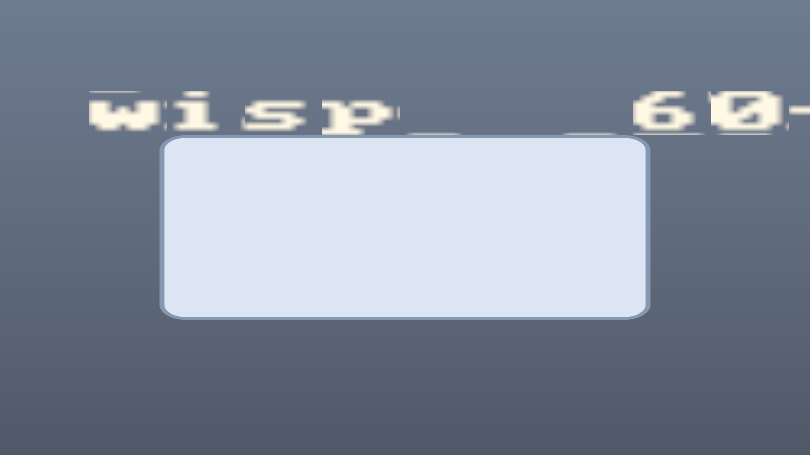

# Export & copy-frame mask parity

Linear: [AUT-27](https://linear.app/harwood/issue/AUT-27) · [AUT-33](https://linear.app/harwood/issue/AUT-33)

*Headless export of a masked scene — the `read_pixels` PNG is
byte-identical to what the preview surface shows for the same
`Stage`.* That parity is the contract this chunk pins down: every
mask primitive (`apply_clip`, `apply_privacy_blur`,
`apply_solid_redaction`, `apply_spotlight`, `apply_dim_outside`)
produces the same pixels in preview and in export.

`wisp` has a single `Renderer::render_stage` entry point that drives
both preview and headless export. Anything `read_pixels` returns is
the same bytes the preview surface shows. AUT-27 and AUT-33 lock in
that "same code path, same bytes" contract for every mask primitive.

## What's tested

- **AUT-27 export parity** (`crates/wisp/tests/export_mask_parity.rs`)
  — render the same scene to two distinct `RenderTexture`s back-to-
  back and assert the byte slices are equal. Five primitives covered:
  `apply_clip`, `apply_solid_redaction`, `apply_spotlight`,
  `apply_privacy_blur`, and `apply_clip_vector` (the freehand-path
  variant).

- **AUT-33 copy-frame parity** (`crates/wisp/tests/copy_frame_mask_parity.rs`)
  — render a masked scene, call `read_pixels` (the surface a future
  copy-frame button will sit on), and verify pixels INSIDE the mask
  region show the masked content while pixels OUTSIDE show the base
  unchanged.

Together: nothing about the mask primitives is preview-only. The
exported file and the copied frame both honor every mask the user
applies.

## Why this matters

Trust. If `apply_solid_redaction` in preview shows a black box but
the export omits it, a creator could publish a video with secrets
visible. The renderer-first architecture eliminates the possibility
by routing every output through the same code path — and these
tests catch any future regression that tries to diverge them.

## Architectural rule (from AUT-27)

> The same scene composition function should drive editor preview,
> headless export, and copied frame/screenshot. Avoid separate
> preview-only mask code.

Already true today — `Renderer::render_stage` is the only path that
produces frames. These tests guard against future drift.

## Done when

- [x] All five M-MASK / M-VEC mask primitives have export-parity
  tests (`export_mask_parity.rs`).
- [x] `read_pixels` after each primitive returns expected masked
  content (`copy_frame_mask_parity.rs`).
- [x] No preview-only mask code path exists.
- [x] `just gate` green.
