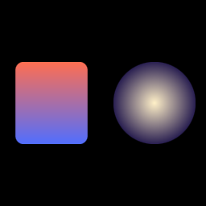

# Gradient fills — M0.14

Two gradient fills in one `Graphics`, one draw call.

The left rounded rect uses a **linear gradient** — the shader projects each
fragment's local position onto the `start → end` line and mixes the two
colors by the projection parameter `t`.

The right ellipse uses a **radial gradient** — `t` is the fragment's
distance from `center` divided by `radius`, clamped to `[0, 1]`.

Both gradients evaluate in primitive-local coordinates
(`[-half_extents, +half_extents]`), so the gradient transforms with the
primitive's container — rotate the parent and the gradient rotates too,
just like a painted gradient on a moving cel.

For the recorder: linear gradients give the padded "wallpaper" backgrounds
(the kind Screen Studio ships) for one extra fill kind; radial gradients
give vignette-style highlights around clicks or focus points.

---

[`Fill` API](../../api/wisp/scene/enum.Fill.html) · [Stories index](../stories.md)
