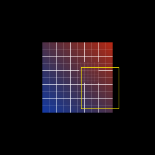

# Rectangle privacy blur

[Linear: AUT-20](https://linear.app/harwood/issue/AUT-20)

`Renderer::apply_privacy_blur(region, radius, base, output)` is the
first masked-filter primitive. It composes three previously shipped
pieces:

1. **Blur** the entire `base` RT into a scratch RT via
   `BlurFilter::new(radius)`.
2. **Clip** the blurred copy to a `MaskShape::Rect { region }`. Outside
   the rect, alpha drops to zero; inside, alpha stays at 1.
3. **Compose** the masked overlay over a fresh copy of the base via the
   blit pipeline's `compose_over` (alpha-blending). Outside the rect
   the base shows through pixel-perfect; inside the rect the blurred
   version wins.

The signature deliberately mirrors `apply_filter` — region + radius +
in/out RTs — so the caller (today: a story; tomorrow: the recorder
front-end) doesn't need to know about the three-RT pipeline behind it.
AUT-21 generalizes the rect to a rounded rect by swapping
`MaskShape::Rect` for `MaskShape::RoundedRect`; the rest of the
composition is unchanged.

## Architecture decisions

- **Three RTs, not two.** A scratch `blur_rt` holds the wholesale
  blurred copy; a scratch `masked_rt` holds the clipped overlay. We
  could fuse blur+clip into a single shader, but reusing the existing
  filter and clip pipelines keeps each primitive single-purpose and
  testable in isolation.
- **`compose_over` over `BlitPipeline::REPLACE`.** A second blit
  pipeline with `BlendState::ALPHA_BLENDING` is needed so the masked
  overlay's transparent pixels don't punch holes in the base. The
  pipeline cache sees both as just two more entries in
  `BlitPipeline`.
- **Coordinates in NDC.** `region` is in NDC (`[-1, +1]²`), matching
  the existing clip primitive. Pixel-space callers convert at their
  edge — keeps the renderer single-coord-system.

## API

[`wisp::Renderer::apply_privacy_blur`](../../api/wisp/render/struct.Renderer.html#method.apply_privacy_blur)
