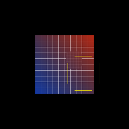

# Rounded privacy blur — M-MASK.3 / AUT-21

AUT-21 generalizes the AUT-20 primitive: `apply_privacy_blur` now
accepts any `MaskShape`, so `MaskShape::RoundedRect { rect, radius }`
produces a privacy redaction with cinematic rounded corners.

The renderer code is unchanged from AUT-20 — same three-stage pipeline
(blur → clip → compose). What changed is the API: the second argument
went from `region: Rect` to `shape: MaskShape`. AUT-20's call site
becomes `MaskShape::rect(region)` (zero-cost — the `Rect` constructor
just wraps the rect in the enum). AUT-22's strength slider, AUT-23's
solid redaction, and AUT-30/-34/-35's circle/ellipse/freehand variants
will all plug in here without further pipeline work.

## Architecture

- **One primitive, many shapes.** `MaskShape` is an enum (`Rect`,
  `RoundedRect`; future: `Circle`, `Ellipse`, `Path`). The clip
  pipeline's WGSL switches on the enum's variant via uniform buffer
  data, so adding a shape is "new variant + SDF formula" — no new
  pipeline, no new bind group layout.
- **Bounding-rect-but-corner is a strict cutout.** For rounded shapes
  we want the corner pixels to remain perfectly equal to `base` (no
  partial alpha leak). The SDF AA band is one output pixel wide; tests
  sample a few pixels in to escape the band and confirm bit-exact
  base bytes there.

## Done when

- [x] `Renderer::apply_privacy_blur` accepts `MaskShape::RoundedRect`.
- [x] Corner radius is a parameter.
- [x] Three pixel-readback tests cover (a) outside bounding rect equals
  base, (b) bounding-rect-but-corner equals base, (c) center seam
  mixes via blur.
- [x] Storybook story `privacy-blur-rounded` ships.
- [x] Output deterministic in story snapshots (`story_fingerprints`
  baseline updated).
- [x] `just gate` green.

## API

[`wisp::Renderer::apply_privacy_blur`](../../api/wisp/render/struct.Renderer.html#method.apply_privacy_blur)
— now generic over [`MaskShape`](../../api/wisp/scene/clip/enum.MaskShape.html).
