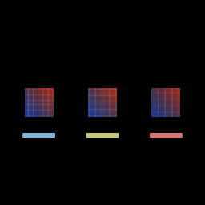

# Privacy blur strengths

[Linear: AUT-22](https://linear.app/harwood/issue/AUT-22)

`BlurStrength` adds the renderer-data API for "how strong." The
`PrivacyBlur` struct now bundles a `MaskShape` (where) with a
`BlurStrength` (how strong); a new
`Renderer::apply_privacy_blur_data(blur, base, output)` consumes that
struct directly so the editor doesn't shuttle raw `f32` radii.

```rust
use wisp::{BlurStrength, PrivacyBlur, math::Rect};

let blur = PrivacyBlur::rect(Rect::new(-0.5, -0.5, 1.0, 1.0))
    .with_strength(BlurStrength::Strong);
renderer.apply_privacy_blur_data(&app, &blur, &base, &output);
```

Variants:

| Variant | Pixel radius | Use |
| --- | --- | --- |
| `Soft` | 6 | Cinematic polish — shapes hint through. |
| `Medium` (default) | 12 | Balanced redaction — text unreadable. |
| `Strong` | 24 | Heavy redaction — wipes nearly all detail. |
| `Custom(f32)` | clamped `[0, 64]` | Escape hatch for custom requirements. |



## Architecture

- **Symbolic enum + numeric escape hatch.** Editor projects persist
  `BlurStrength::Soft` (a name); the radius mapping can be retuned
  without breaking project files. `Custom(f32)` lets stories and
  tests pin an exact pixel value when they need determinism.
- **Builder-style overrides.** `PrivacyBlur::rect(r).with_strength(s)`
  reads top-down without forcing callers to hand-construct the struct.
- **Default = Medium.** Unconfigured blurs land at the balanced
  preset, matching the most common publish-safety case.

## API

- [`wisp::BlurStrength`](../../api/wisp/scene/privacy_blur/enum.BlurStrength.html)
- [`wisp::PrivacyBlur`](../../api/wisp/scene/privacy_blur/struct.PrivacyBlur.html)
- [`wisp::Renderer::apply_privacy_blur_data`](../../api/wisp/render/struct.Renderer.html#method.apply_privacy_blur_data)
