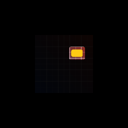
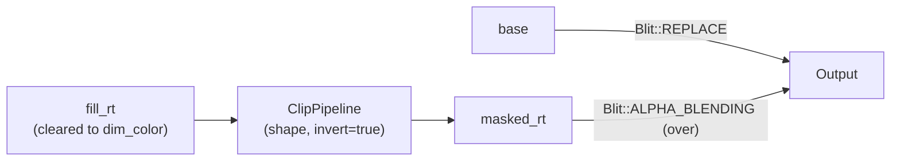

# Spotlight / highlight

[Linear: AUT-28](https://linear.app/harwood/issue/AUT-28)

`Renderer::apply_spotlight(shape, dim_color, base, output)` is the
attention-guiding primitive. Pixels *inside* `shape` show through
unchanged; pixels *outside* are blended toward `dim_color`. Reuse of
the same `MaskShape` enum means rect / rounded-rect / future circle /
ellipse / freehand all work identically.

```rust
use wisp::{Color, MaskShape, math::Rect};

let focus = Rect::new(0.18, -0.6, 0.55, 0.45);
renderer.apply_spotlight(
    &app,
    MaskShape::rounded_rect(focus, 0.06),
    Color::rgba(0.0, 0.0, 0.0, 0.7),
    &base,
    &output,
);
```



## Architecture

Same composition as solid redaction with one bit flipped: the clip
pipeline runs in `apply_inverted` mode. The WGSL invert is a uniform
flag (`invert: f32`); same pipeline, no separate shader.



Adding an invert flag to one shader is cheaper than building a second
"outside-only" pipeline:

- One shader, one bind-group layout, one pipeline cache entry.
- The dispatcher's existing `apply_clip` keeps working as-is (default
  `invert=false`).
- AUT-29 (dim-outside) becomes a thin wrapper that sets a stronger
  `dim_color` alpha; no further renderer work.

## API

[`wisp::Renderer::apply_spotlight`](../../api/wisp/render/struct.Renderer.html#method.apply_spotlight)
