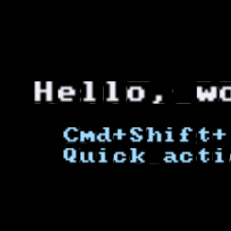

# Bitmap text — M0.15

Bitmap glyph rendering using the embedded `font8x8` ASCII set.

Each character is an 8×8 pixel bitmap packed into a 128×128 atlas (16×16
grid). The text pipeline emits one instance per glyph; instances from all
`Text` nodes that share a font atlas batch into a single draw call (this
story = 2 Text nodes × N chars = 1 draw call).

**Why bitmap not vector:** zero external font files, deterministic, tiny
dep. When the recorder needs anti-aliased type at multiple sizes, we add
`fontdue` as a separate `Font` variant — but the `Font` / `Text` API stays
the same.

**Layout:** cursor flows left-to-right; `\n` resets `cursor.x = 0` and moves
`cursor.y` down by `line_height = cell_size × 1.25`. Anchor is the top-left
of the first line; `transform.position` places that anchor in scene-graph
world coords.

**Color:** per-`Text`. To recolor mid-string would require multiple `Text`
nodes — fine for the recorder (keyboard chips, captions) where we never mix
colors mid-glyph.

---

[`Text` API](../../api/wisp/scene/struct.Text.html) · [`Font`](../../api/wisp/scene/struct.Font.html) · [Stories index](../stories.md)
