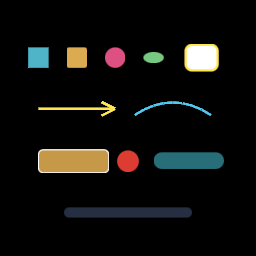

# Vector primitive examples gallery — M-VEC.12 / AUT-64

Closes the M-VEC track. Single-canvas overview of the catalog —
glance to confirm the surface, then drill into the chunk chapter
for any specific primitive.

| Region | Primitive | Chapter |
|---|---|---|
| Top row | Basic shapes — `Rect / RoundedRect / Circle / Ellipse` | [vector-render](./vector-render.md) |
| Top right | `Highlight::outline` ring | [vector-highlight-callout](./vector-highlight-callout.md) |
| Middle | `Callout::arrow_to` + `PathBuilder::quad_to` | [vector-path-stroke](./vector-path-stroke.md) |
| Lower | `Callout::label_box`, `badge`, `Highlight::pill` | [vector-highlight-callout](./vector-highlight-callout.md) |
| Bottom | `Callout::caption_pill` | [vector-highlight-callout](./vector-highlight-callout.md) |

## M-VEC track index

| Chunk | Issue | Primitive |
|---|---|---|
| M-VEC.1 | AUT-53 | Vector shape primitive model |
| M-VEC.2 | AUT-54 | Render vectors as scene geometry |
| M-VEC.3 | AUT-55 | Vector → alpha-mask texture bridge |
| M-VEC.4 | AUT-56 | Privacy blur uses vector masks |
| M-VEC.5 | AUT-57 | Solid redaction uses vector masks |
| M-VEC.6 | AUT-58 | Clip + spotlight use vector masks |
| M-VEC.7 | AUT-59 | Vector spotlight + inverse-dim |
| M-VEC.8 | AUT-60 | Highlight overlay primitives |
| M-VEC.9 | AUT-61 | Callout primitives |
| M-VEC.10 | AUT-62 | Path stroke commands |
| M-VEC.11 | AUT-63 | Mask boolean operations |
| M-VEC.12 | AUT-64 | This gallery (close) |

## M-DYN track index

| Chunk | Issue | Primitive |
|---|---|---|
| M-DYN.1 | AUT-43 | Dynamic alpha-mask texture primitive |
| M-DYN.2 | AUT-44 | Mask texture cache |
| M-DYN.3-6 | AUT-45/-46/-47/-48 | Explicit-mask composition primitives |

## Companion mask + export chapters

- [export-mask-parity](./export-mask-parity.md) — AUT-27 + AUT-33,
  preview / export / copy-frame parity tests.
