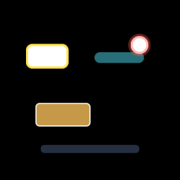

# Highlight + callout primitives

Linear: [AUT-60](https://linear.app/harwood/issue/AUT-60) · [AUT-61](https://linear.app/harwood/issue/AUT-61)

`Highlight` (M-VEC.8) and `Callout` (M-VEC.9) are preset constructors
for the most common attention-guiding overlays. They produce plain
`Vector`s — same data type as the rest of the M-VEC catalog — so they
chain through every existing builder (`with_transform`,
`with_opacity`, `add_to_stage`) and feed into vector storyboards
(M-VEC.12).

```rust
use glam::Vec2;
use wisp::{Callout, Color, Highlight, VectorShape, VectorStroke, math::Rect};

let outline = Highlight::outline(
    VectorShape::rounded_rect(Rect::new(-0.7, 0.25, 0.45, 0.25), 0.06),
    Color::rgba_u8(255, 230, 80, 255),
    0.025,
);

let label = Callout::label_box(
    Rect::new(-0.6, -0.4, 0.6, 0.25),
    Color::rgba_u8(220, 170, 80, 230),
    Some(VectorStroke::new(0.012, Color::WHITE)),
    0.04,
);

let badge = Callout::badge(Vec2::new(0.55, 0.5), 0.085, Color::rgba_u8(220, 60, 50, 255));
```



## Catalog

### `Highlight` (M-VEC.8 / AUT-60)

| Constructor | Returns | Use |
|---|---|---|
| `outline(shape, color, width)` | stroke-only `Vector` | Glowing border around buttons, fields. |
| `filled(shape, color, alpha)` | filled `Vector` with multiplied alpha | Translucent highlight; underlying content visible. |
| `pill(rect, color, alpha)` | rounded-rect with `radius = h/2` | Menu-item / chip / inline emphasis. |
| `glow(shape, color, width)` | stroke at 0.4× alpha | Cheap glow approximation. True Gaussian glow lands with M-DYN.7 feathering. |

### `Callout` (M-VEC.9 / AUT-61)

| Constructor | Returns | Use |
|---|---|---|
| `label_box(rect, fill, stroke, radius)` | rounded-rect with optional outline | Annotation cards. |
| `badge(center, radius, fill)` | filled circle | Numbered step markers, dots. |
| `caption_pill(rect, fill)` | wide rounded-rect, `radius = h/2` | Single-line bottom captions. |

## Done when

- [x] All M-VEC.8 highlight variants ship (`outline`, `filled`,
  `pill`, `glow` placeholder).
- [x] All M-VEC.9 callout variants ship (`label_box`, `badge`,
  `caption_pill`).
- [x] Unit tests cover constructor invariants (8 tests across both
  modules).
- [x] Story `vector-overlays` shows all six presets in one
  composition.
- [x] `just gate` green.

## Known gaps

- **Arrow / pointer-line callouts** need stroke-along-path commands
  (M-VEC.10 / AUT-62). Once that lands, an `arrow_to(from, to)`
  constructor can join the `Callout` module without breaking
  changes.
- **True Gaussian glow** depends on M-DYN.7 (AUT-49 P2) feathering.
  Until then, `Highlight::glow` is a wider-stroke approximation.

## API

- [`wisp::Highlight`](../../api/wisp/scene/highlight/struct.Highlight.html)
- [`wisp::Callout`](../../api/wisp/scene/callout/struct.Callout.html)
