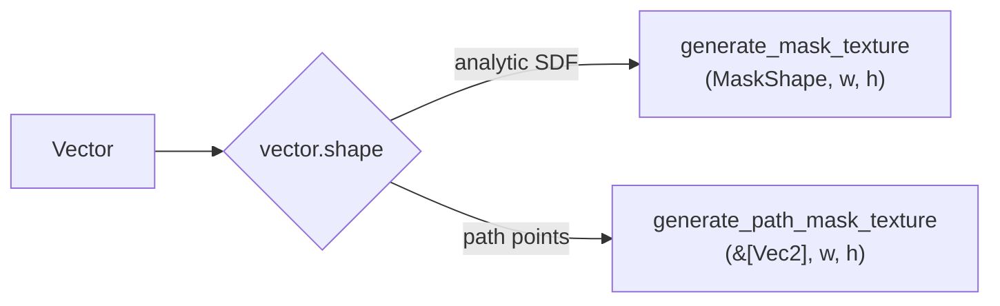

# Render vectors to alpha-mask textures

[Linear: AUT-55](https://linear.app/harwood/issue/AUT-55)


*Output of the bridge: the M-DYN.1 alpha contact sheet — rect,
rounded-rect, circle, ellipse, freehand star. Every tile is what
`generate_vector_mask_texture` produces for the corresponding
`Vector`.* The bridge picks between the analytic SDF path and the
freehand path mask based on the shape variant; the resulting alpha
RT is byte-identical to what `generate_mask_texture(MaskShape::…)`
or `generate_path_mask_texture(&[Vec2])` would emit directly.

`Renderer::generate_vector_mask_texture(vector, w, h)` and the
cached companion bridge a [`Vector`] primitive to the M-DYN.1 alpha
mask texture path. The bridge is a single dispatch:



Only `vector.shape` is consulted — `fill` / `stroke` / `opacity` /
`transform` don't affect mask coverage.

```rust
use wisp::{Vector, VectorShape, math::Rect};

let vec = Vector::new(VectorShape::rounded_rect(
    Rect::new(-0.5, -0.5, 1.0, 1.0),
    0.2,
));

// Same alpha texture as `generate_mask_texture(MaskShape::RoundedRect{..})`
// — the bridge adds zero pixel-level difference.
let mask = renderer.generate_vector_mask_texture(&app, &vec, 256, 256);

// Cached version — analytic shapes go through the M-DYN.2 cache;
// path shapes bypass (V1 limitation).
let cached_mask = renderer.cached_vector_mask_texture(&app, &vec, 256, 256);
```

This is the bridge that **M-VEC.4..6 will use** to refactor existing
mask primitives onto vector data:

- M-VEC.4 (privacy blur) — `Vector` → mask texture → blur kernel
  composed only inside the mask.
- M-VEC.5 (solid redaction) — `Vector` → mask texture → solid fill
  composed only inside the mask.
- M-VEC.6 (rounded screen / webcam crops) — `Vector` → mask texture
  → clip pass over the recording surface.

## Architecture

The dispatch reads `VectorShape` and routes:

- `Rect` / `RoundedRect` / `Circle` / `Ellipse` →
  `as_mask_shape()` → analytic SDF generator.
- `Path { points }` → `as_path_points()` → polygon mask generator.
- Future variant (catalog is `#[non_exhaustive]`) → empty mask + a
  `debug_assert!` so we notice during development.

Cached version mirrors the same dispatch:

- Analytic → `cached_mask_texture(...)` → goes through the
  M-DYN.2 cache.
- Path → fresh `generate_path_mask_texture(...)` wrapped in `Arc`;
  bypasses the cache (paths can't currently be hashed; documented
  in M-DYN.2's chapter).

## API

- [`wisp::Renderer::generate_vector_mask_texture`](../../api/wisp/render/struct.Renderer.html#method.generate_vector_mask_texture)
- [`wisp::Renderer::cached_vector_mask_texture`](../../api/wisp/render/struct.Renderer.html#method.cached_vector_mask_texture)
