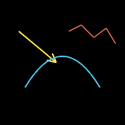
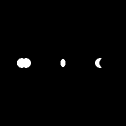

# Vector path stroke + boolean ops

Linear: [AUT-62](https://linear.app/harwood/issue/AUT-62) · [AUT-63](https://linear.app/harwood/issue/AUT-63)

Two M-VEC chunks shipped in one chapter — both extend the vector
catalog with primitives that the rest of the M-VEC track depends on.

## M-VEC.10 — Path stroke (AUT-62)

`PathBuilder` chains `move_to / line_to / quad_to / cubic_to / close`
commands. `Path::flatten(tolerance)` does adaptive Bezier
subdivision via the perpendicular-distance test, returning a
`Vec<Vec2>` polygon. `Path::stroke_to_graphics(width, color,
tolerance)` rasterizes the path as a stroked `Graphics` (one
`draw_line` per flattened segment).

```rust
use glam::Vec2;
use wisp::{Color, PathBuilder};

let curve = PathBuilder::new()
    .move_to(Vec2::new(-0.6, -0.4))
    .quad_to(Vec2::new(0.0, 0.6), Vec2::new(0.6, -0.4))
    .build()
    .stroke_to_graphics(0.025, Color::rgba_u8(80, 200, 240, 255), 0.005);
```



**`Callout::arrow_to(from, to, width, color)`** is the first
consumer — it's the path-stroke companion to the static
`Callout::label_box` / `badge` / `caption_pill` from M-VEC.9.

**V1 limitations:**

- Joins between segments are butt-style. Mitered / round joins
  await follow-up.
- `Path::flatten` returns the raw polygon; consumers feed it into
  `VectorShape::Path` for masking. The 32-vertex `MAX_PATH_POINTS`
  cap in `path_clip.wgsl` still applies for *masking*; visible
  stroked rendering doesn't share that cap.

## M-VEC.11 — Mask boolean ops (AUT-63)

`Renderer::combine_masks(a, b, op, output)` produces a new mask
texture from two inputs and a `MaskCombineOp`:

| Op | Result |
|---|---|
| `Union` | `max(a, b)` — pixel covered by either mask. |
| `Intersect` | `a × b` — pixel covered by both. |
| `Subtract` | `a × (1 − b)` — pixel covered by `a` but not `b`. |

```rust
use wisp::{MaskCombineOp, MaskShape, math::Rect};

let a = renderer.generate_mask_texture(&app, MaskShape::circle(...), w, h);
let b = renderer.generate_mask_texture(&app, MaskShape::circle(...), w, h);

let out = RenderTexture::with_format(&app, w, h, format);
renderer.combine_masks(&app, &a, &b, MaskCombineOp::Intersect, &out);
```



Outputs are regular alpha-mask `RenderTexture`s, so they flow into
any downstream composition primitive (`apply_mask_to_texture`,
`compose_blur_through_mask`, etc.).

Backed by `mask_combine.wgsl`: one shader, three op codes, branches
on a uniform `u32`.

## Lesson — WGSL vec3 alignment (CLAUDE.md)

The boolean-ops uniform struct shipped with a layout mismatch on
first run — WGSL `vec3<u32>` is 16-byte aligned, so a struct
`{ op: u32, _pad: vec3<u32> }` is 32 bytes, not 16. The matching
Rust struct must pad to the same size or wgpu rejects the bind
group. Captured in CLAUDE.md "WGSL ↔ Rust uniform layout."

## Done when

- [x] `PathBuilder` chains move/line/quad/cubic/close.
- [x] `Path::flatten` adaptive Bezier subdivision works.
- [x] `Path::stroke_to_graphics` rasterizes as segments.
- [x] `Callout::arrow_to` uses the path stroke.
- [x] `Renderer::combine_masks` ships Union/Intersect/Subtract.
- [x] 9 path-flatten tests + 3 mask-combine tests pass.
- [x] Stories `path-stroke` and `mask-combine` ship.
- [x] `just gate` green.
