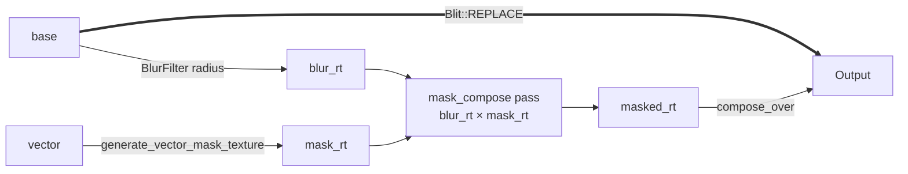

# Privacy blur on vector masks

[Linear: AUT-56](https://linear.app/harwood/issue/AUT-56)


*Output is pixel-identical to the M-MASK.3 rounded privacy blur —
the same blur radius, the same rounded-rect coverage, just driven by
a `Vector` instead of a `MaskShape`.* The bridge picks the analytic
SDF path; the cached mask texture is shared across frames and across
effects.

`Renderer::apply_privacy_blur_vector(vector, radius, base, output)`
drives the privacy-blur composition from a `Vector` instead of a
`MaskShape`. Two practical wins:

1. **Path support.** Freehand polygons can now drive privacy blur
   directly. Previously you had to call `apply_path_clip` against a
   manually-blurred RT and stitch the composition yourself.
2. **Cache reuse.** The mask texture comes from
   `cached_vector_mask_texture(...)`, so a static privacy region
   re-evaluated each frame skips regeneration.

The old `apply_privacy_blur(shape: MaskShape, ...)` API still works
unchanged. Internally it now wraps the `MaskShape` in a `Vector` and
forwards to `apply_privacy_blur_vector`. Output is byte-equivalent
to the previous inline-clip implementation — the existing M-MASK.2 /
M-MASK.3 / M-MASK.4 tests pass without modification.

```rust
use glam::Vec2;
use wisp::{Vector, VectorShape, math::Rect};

// New: path-driven privacy blur (impossible before M-VEC.4).
let diamond = Vector::new(VectorShape::path(vec![
    Vec2::new( 0.0,  0.6),
    Vec2::new( 0.6,  0.0),
    Vec2::new( 0.0, -0.6),
    Vec2::new(-0.6,  0.0),
]));
renderer.apply_privacy_blur_vector(&app, &diamond, 12.0, &base, &output);

// Old API still works — equivalent to apply_privacy_blur_vector
// with `Vector::new(VectorShape::rect(...))`.
renderer.apply_privacy_blur(&app, MaskShape::rect(rect), 8.0, &base, &output);
```

## Architecture

The new pipeline replaces the inline `clip.wgsl` pass with a
two-shader sequence: generate the mask once, then compose. Both
existing M-MASK call paths route through it.



New primitive: `Renderer::apply_mask_to_texture(foreground, mask,
output)` is the public surface for the `mask × foreground` step.
Documented separately so AUT-57 (solid redaction) and AUT-58
(rounded crop) reuse it.

The cost of an extra render pass per primitive call is offset by
mask-cache hits. Static masks (the common case in screen
recordings) regenerate exactly once per (shape, dims, invert) tuple.

## Existing M-MASK chapters — preserved

The M-MASK.2 (rectangle privacy blur), M-MASK.3 (rounded privacy
blur), and M-MASK.4 (configurable strength) chapters describe the
*public API* — that surface is unchanged. The architecture sections
in those chapters describe the previous inline-clip pipeline; that
description is now historical. The active pipeline is the one
documented above.

## Done when

- [x] `apply_privacy_blur_vector` accepts any `VectorShape`
  including `Path`.
- [x] Existing `apply_privacy_blur(shape: MaskShape, ...)` call sites
  produce byte-equivalent output (9 M-MASK.2/.3/.4 tests pass
  unchanged).
- [x] New tests cover path-driven privacy blur.
- [x] `apply_mask_to_texture` is the documented intermediate
  primitive used by the refactor and by AUT-57/-58.
- [x] `just gate` green.

## API

- [`wisp::Renderer::apply_privacy_blur`](../../api/wisp/render/struct.Renderer.html#method.apply_privacy_blur)
- [`wisp::Renderer::apply_privacy_blur_vector`](../../api/wisp/render/struct.Renderer.html#method.apply_privacy_blur_vector)
- [`wisp::Renderer::apply_mask_to_texture`](../../api/wisp/render/struct.Renderer.html#method.apply_mask_to_texture)
