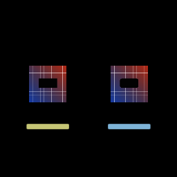

# Solid redaction on vector masks

[Linear: AUT-57](https://linear.app/harwood/issue/AUT-57)



*Output is pixel-identical to the M-MASK.5 solid redaction — same
coverage, same fill color, just driven by a `Vector` instead of a
`MaskShape`.* Now also accepts path-shaped vectors (custom polygons,
not just analytic shapes).

`Renderer::apply_solid_redaction_vector(vector, color, base, output)`
drives the solid-redaction composition from a `Vector`. Like
M-VEC.4's privacy blur, the existing `apply_solid_redaction(shape:
MaskShape, ...)` API stays unchanged — internals route through the
shared mask + compose path. The 4 existing M-MASK.5 tests pass
byte-equivalent.

```rust
use glam::Vec2;
use wisp::{Color, Vector, VectorShape};

// Path-driven redaction (impossible before M-VEC.5):
let diamond = Vector::new(VectorShape::path(vec![
    Vec2::new( 0.0,  0.6),
    Vec2::new( 0.6,  0.0),
    Vec2::new( 0.0, -0.6),
    Vec2::new(-0.6,  0.0),
]));
renderer.apply_solid_redaction_vector(
    &app,
    &diamond,
    Color::rgba_u8(10, 30, 200, 255),
    &base,
    &output,
);
```

## Architecture

Identical structure to M-VEC.4. Only step 1 (the *what's inside*)
differs from privacy blur:

| Stage | Privacy blur (M-VEC.4) | Solid redaction (M-VEC.5) |
|---|---|---|
| 1 | `BlurFilter(radius)` | clear `fill_rt` to color |
| 2 | `cached_vector_mask_texture(vec)` | same |
| 3 | `apply_mask_to_texture(blur, mask)` | `apply_mask_to_texture(fill, mask)` |
| 4 | blit base + compose_over | same |

Reuses the M-VEC.4 `MaskComposePipeline` and the M-DYN.2 mask cache
without adding any new pipelines or shaders.

## API

- [`wisp::Renderer::apply_solid_redaction`](../../api/wisp/render/struct.Renderer.html#method.apply_solid_redaction)
- [`wisp::Renderer::apply_solid_redaction_vector`](../../api/wisp/render/struct.Renderer.html#method.apply_solid_redaction_vector)
