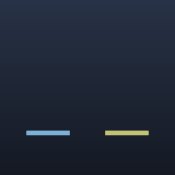

# Webcam shapes — M-MASK.8 / AUT-30

`MaskShape::Circle { center, radius }` joins `Rect` and `RoundedRect`,
giving the webcam overlay two cinematic options out of the box:

- **Circle** — creator-style YouTube/Twitch overlay.
- **Rounded rectangle** — professional walkthrough framing.

Both are pure `MaskShape` enum variants; no new shader, no new
pipeline. The `apply_clip` / `apply_privacy_blur` /
`apply_solid_redaction` / `apply_spotlight` primitives all accept the
new variant automatically.

```rust
use wisp::{MaskShape, math::Rect};

// Creator-style circle overlay.
let circle = MaskShape::circle(glam::Vec2::ZERO, 0.85);

// Professional walkthrough rounded-rect overlay.
let rounded = MaskShape::rounded_rect(Rect::new(-0.85, -0.85, 1.7, 1.7), 0.18);
```



## Architecture

`MaskShape::Circle` is implemented by translating to the existing
rounded-rect SDF: `half_extents = (radius, radius)`, `corner_radius =
radius`. The rounded-rect formula degenerates to `length(p) - r` in
that case — the circle SDF — so a single shader handles both cases.

```rust
// Inside ClipPipeline::apply_with_invert (clip.rs):
MaskShape::Circle { center, radius } => {
    let r = radius.max(0.0);
    (center.x, center.y, r, r, r)
}
```

This is the same trick we used for `MaskShape::Rect` (which is
`RoundedRect { radius: 0 }` under the hood). Three shape variants,
one shader, one bind-group layout — and it scales: AUT-34 (ellipse)
and AUT-35 (freehand path) will need a different SDF, but until then
the circle stays free.

## Done when

- [x] Webcam overlay supports circle crop (`MaskShape::Circle`).
- [x] Webcam overlay supports rounded-rectangle crop (`MaskShape::RoundedRect`,
  shipped in M-MASK.1).
- [x] Shape choice is reusable data (`MaskShape` enum, persistable).
- [x] Story `webcam-shapes` shows both shapes side-by-side.
- [x] Snapshot coverage (story fingerprint + regenerated PNG asset).
- [x] Same scene-graph machinery backs preview + headless export
  (single `MaskShape` enum used by all primitives).
- [x] `just gate` green.

## API

[`wisp::MaskShape::Circle`](../../api/wisp/scene/clip/enum.MaskShape.html#variant.Circle)
